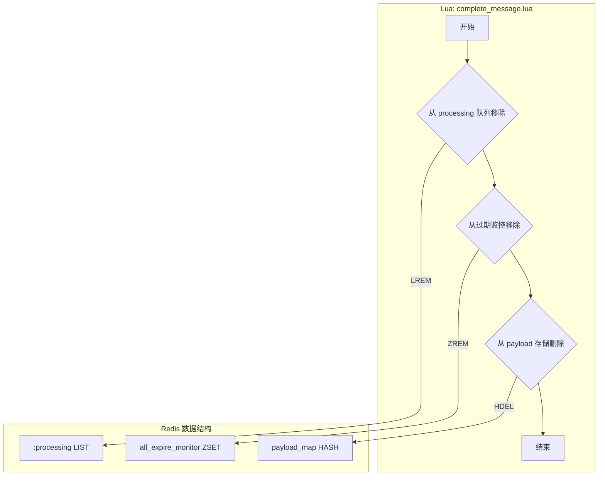
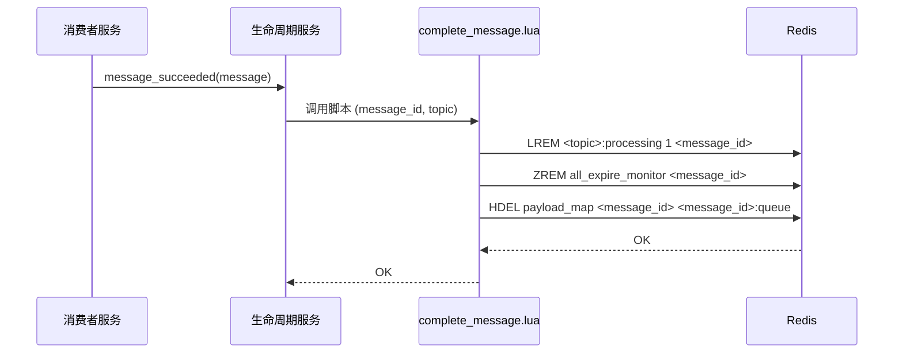

# Lua Script: complete_message.lua

## 1. 功能概述

`complete_message.lua` 脚本在消息被成功处理后执行。它的核心职责是原子性地清理与该消息相关的所有数据，包括从处理中队列（`processing` List）、过期监控（`expire_monitor` ZSet）和消息内容存储（`payload_map` Hash）中移除相关条目。

## 2. 设计原理

该脚本的设计思想是“清理即完成”。一旦消息的业务逻辑成功执行，就必须将其从系统中彻底、原子性地移除，以防止其被错误地再次处理（例如，被超时监控服务误判为卡死任务）。

### 2.1 数据结构关系图

## 3. 数据结构详解

`complete_message.lua` 脚本与 `produce_normal_message.lua` 操作的数据结构紧密相关，主要涉及对以下三个核心数据结构的清理操作。

### 3.1 数据结构定义

1.  **处理中任务队列 (<topic>:processing)**
    *   **类型**: Redis List
    *   **结构**:
        *   `key`: `mx-rmq:{topic_name}:processing`
        *   `element`: `message_id`
    *   **用途**: 临时存放那些已经被消费者取出、正在处理中的消息 `message_id`。它的主要作用是提供一个可见性窗口，让系统可以监控那些长时间处于“处理中”状态的任务，以防消费者崩溃导致任务丢失。

2.  **全局过期监控集合 (all_expire_monitor)**
    *   **类型**: Redis Sorted Set (ZSet)
    *   **结构**:
        *   `key`: `mx-rmq:all_expire_monitor`
        *   `score`: `expire_time` (消息的毫秒级过期时间戳)
        *   `member`: `message_id`
    *   **用途**: 与生产时相同，统一监控所有消息的过期。成功处理完消息后，必须从中移除，以防止被过期处理机制误判。

3.  **消息内容存储 (payload_map)**
    *   **类型**: Redis Hash
    *   **结构**:
        *   `key`: `mx-rmq:{queue_name}:payload`
        *   `field`: `message_id` (消息体)
        *   `field`: `{message_id}:queue` (队列归属)
    *   **用途**: 存储消息的完整内容。消息处理完成后，其内容和元数据都需要被彻底删除以释放空间。

### 3.2 选择原因说明

这些数据结构的选择理由与 `produce_normal_message.lua` 中所述一致。这里的关键在于 **“完成”** 操作的原子性：

*   **为什么需要原子性地清理这三者？**
    *   **防止数据不一致**: 想象一下，如果不是原子操作：
        1.  程序先执行 `LREM` 从 `processing` 队列移除消息。
        2.  在执行 `ZREM` 之前，程序崩溃了。
    *   **结果**: 消息从 `processing` 队列消失了，但它仍然存在于 `all_expire_monitor` ZSet 中。当过期监控任务运行时，它会发现这个 `message_id` 已经过期，但由于它已不在 `processing` 队列中，系统可能会认为这是一个异常状态，或者更糟，无法正确地将其归档或移入死信队列，导致数据残留和潜在的逻辑错误。
    *   **Lua 的优势**: 将 `LREM`、`ZREM` 和 `HDEL` 封装在单个 Lua 脚本中，可以确保这三个清理步骤要么全部成功，要么全部失败，从而完美地规避了上述风险，保证了系统的最终一致性。

## 4. 设计优势

- **原子性**: 将三个独立的删除操作（`LREM`, `ZREM`, `HDEL`）合并到一个脚本中，确保了清理操作的原子性。这避免了在清理过程中因部分操作失败而导致数据残留（例如，消息从 `processing` 队列移除了，但还存在于 `expire_monitor` 中），从而保证了系统的最终一致性。
- **高性能**: 通过一次网络请求完成所有清理工作，减少了网络开销，提升了消息确认阶段的性能。
- **职责单一**: 脚本的功能非常明确，就是“完成并清理”。这使得代码易于理解和维护。

## 5. 核心流程图

## 6. 重要设计要点

- **`LREM` 的使用**: `LREM <queue> 1 <value>` 命令会从列表中移除第一个匹配 `<value>` 的元素。这对于 `processing` 队列是安全的，因为一个消息 ID 在同一时间点只应该在 `processing` 队列中出现一次。
- **数据清理的彻底性**: 脚本不仅删除了消息的主体内容（`HDEL payload_map <message_id>`），还删除了其队列归属信息（`HDEL payload_map <message_id>:queue`），确保了没有任何残留数据占用 Redis 内存。
- **与重试/死信的区别**: 此脚本是消息处理成功后的最终状态。如果消息处理失败，则会调用 `retry_message.lua` 或 `move_to_dlq.lua`，而不是本脚本。
