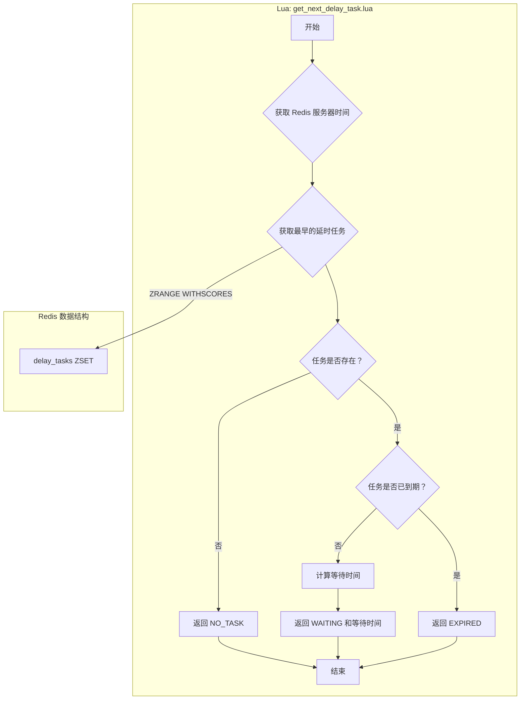
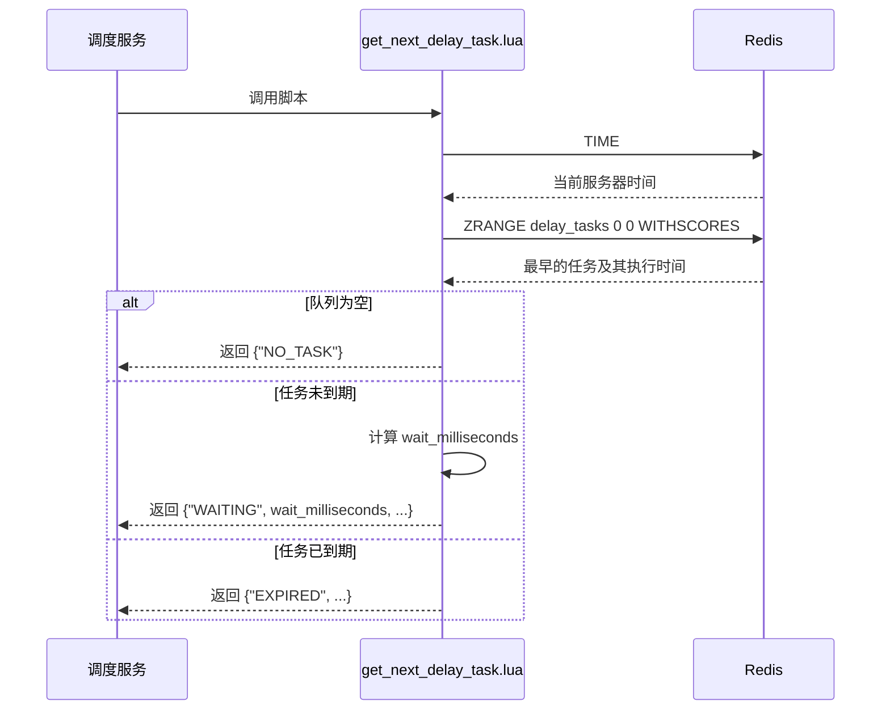

# Lua Script: get_next_delay_task.lua

## 1. 功能概述

`get_next_delay_task.lua` 脚本用于检查延时任务队列（`delay_tasks` ZSet）的状态。它被调度器循环调用，以确定下一步的操作：是应该无限期等待、等待一个精确的时间，还是立即处理已到期的任务。

## 2. 设计原理

该脚本的核心是获取延时队列中最早的任务（score 最小的成员），并将其执行时间与 Redis 服务器的当前时间进行比较。根据比较结果，返回一个明确的状态码和必要的附加信息（如需要等待的时间）。

### 2.1 数据结构关系图

## 3. 数据结构详解

`get_next_delay_task.lua` 脚本是延时任务调度器的“眼睛”，它只读地查询延时任务的核心数据结构，为调度循环提供决策依据。

### 3.1 数据结构定义

1.  **延时任务集合 (delay_tasks)**
    *   **类型**: Redis Sorted Set (ZSet)
    *   **结构**:
        *   `key`: `mx-rmq:{queue_name}:delay_tasks`
        *   `score`: `execute_time` (任务的毫秒级执行时间戳)
        *   `member`: `message_id`
    *   **用途**: 存储所有待执行的延时任务。此脚本的核心操作就是从这个 ZSet 中窥探（peek）第一个元素，即执行时间最早的任务。

### 3.2 选择原因说明

*   **为什么只依赖 Sorted Set (ZSet)？**
    *   **高效的“窥探”操作**: ZSet 的 `ZRANGE <key> 0 0 WITHSCORES` 命令可以在 O(log N) 的时间内获取到 `score` 最小的成员及其 `score` 值，而无需将整个集合传输到客户端。这对于需要频繁检查下一个任务的调度器来说，是最高效的方式。
    *   **决策所需的最少信息**: 要做出调度决策（等待、处理、或休眠），调度器只需要知道“下一个任务什么时间执行”。ZSet 完美地提供了这个信息 (`execute_time` as `score`)，而无需关心任务的具体内容 (`payload`)。
    *   **只读安全性**: 该脚本对 `delay_tasks` ZSet 只进行读操作，不涉及任何修改。这保证了它不会产生任何副作用，可以被多个调度器实例安全地并发调用，而不会互相干扰或导致数据竞争。将决策逻辑（本脚本）与执行逻辑（如 `process_delay_message.lua`）分离，也遵循了良好的软件设计原则。

## 4. 设计优势

- **状态明确**: 脚本返回三个清晰的状态：`NO_TASK`, `EXPIRED`, `WAITING`。这种设计使得调用方（调度器）的逻辑非常简单，只需一个 `if/elif/else` 结构即可处理所有情况，避免了复杂的判断逻辑。
- **精确等待**: 当返回 `WAITING` 状态时，脚本会精确计算出需要等待的毫秒数。这使得调度器可以使用 `asyncio.Event` 的 `wait(timeout)` 功能实现精确、低功耗的等待，而不是采用消耗资源的轮询方式。
- **时间源统一**: 脚本强制使用 Redis 的 `TIME` 命令作为唯一的时间源，彻底避免了因多个客户端或服务器时钟不一致而导致的调度错误。
- **高效查询**: 利用 ZSet 的特性，`ZRANGE delay_tasks 0 0 WITHSCORES` 是一个 O(log N) 的高效操作，即使在延时任务数量巨大的情况下也能保持高性能。

## 5. 核心流程图

## 6. 重要设计要点

- **返回值结构**: 脚本的返回值是一个 Lua table（在 Python 中被解析为 list），第一个元素是状态码，后续元素是附加信息。这种结构清晰且易于扩展。
- **无副作用**: 该脚本是只读的，不修改任何 Redis 数据。这使得它可以被安全地、频繁地调用，而不用担心数据一致性问题。
- **与 `process_delay_message.lua` 的协同**: 该脚本负责“决策”，而 `process_delay_message.lua` 负责“执行”。两者共同构成了延时任务调度器的核心。
