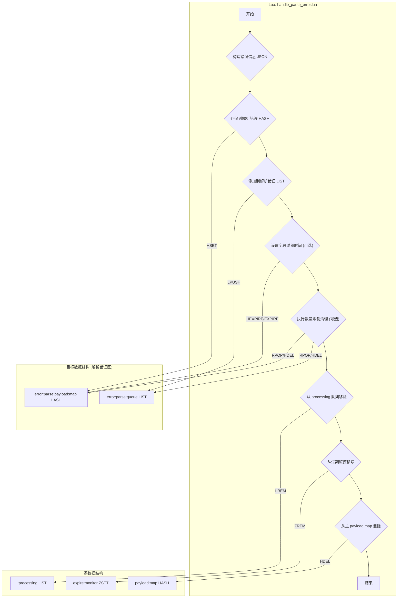
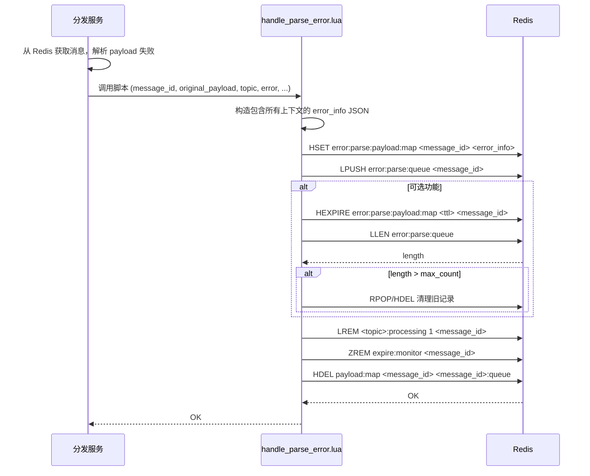

# Lua Script: handle_parse_error.lua

## 1. 功能概述

`handle_parse_error.lua` 是一个专门处理数据完整性问题的脚本。当消费者从 Redis 中获取到的消息 payload 无法被正确解析时（例如，JSON 格式损坏），该脚本被调用。它负责原子性地将这些损坏的消息从正常的处理流程中移除，并将其详细信息存入一个专门的“解析错误”存储区，以供后续分析和排查。

## 2. 设计原理

该脚本的设计思想是“隔离并归档损坏数据”。它认识到解析错误是一种比业务逻辑失败更严重的问题，因为它表明数据在生产或传输过程中可能已经损坏。因此，这类消息不应进入常规的重试或死信队列，而应被隔离到专门的地方。脚本原子性地执行“归档”和“清理”操作，确保系统不会因为坏数据而阻塞。

### 2.1 数据结构关系图

## 3. 数据结构详解

`handle_parse_error.lua` 脚本是一个专门的异常处理器，用于隔离和归档在数据层面就已损坏的消息。它使用了专门的、与主业务逻辑和死信队列都不同的数据结构。

### 3.1 数据结构定义

#### 源数据结构 (将被清理)

1.  **处理中任务队列 (<topic>:processing)**
    *   **类型**: Redis List
    *   **用途**: 清理损坏消息的 `message_id`。

2.  **全局过期监控集合 (all_expire_monitor)**
    *   **类型**: Redis Sorted Set (ZSet)
    *   **用途**: 移除损坏消息的过期监控。

3.  **消息内容存储 (payload_map)**
    *   **类型**: Redis Hash
    *   **用途**: 彻底删除损坏消息的原始记录。

#### 目标数据结构 (解析错误区)

4.  **解析错误内容存储 (error:parse:payload:map)**
    *   **类型**: Redis Hash
    *   **结构**:
        *   `key`: `mx-rmq:error:parse:payload`
        *   `field`: `message_id`
        *   `value`: `error_info_json` (一个包含原始 payload、错误信息、时间戳、来源主题等信息的 JSON 字符串)
    *   **用途**: 永久或限时地保存关于解析错误的完整上下文信息，是调试问题的核心数据源。

5.  **解析错误队列 (error:parse:queue)**
    *   **类型**: Redis List
    *   **结构**:
        *   `key`: `mx-rmq:error:parse:queue`
        *   `element`: `message_id`
    *   **用途**: 按照时间顺序保存发生解析错误的 `message_id` 列表，为管理工具提供一个有序的错误索引。

### 3.2 选择原因说明

*   **为什么要为解析错误设计专门的数据结构？**
    *   **问题性质不同**: 解析错误通常意味着数据从源头（生产者）或在传输过程中就已经损坏。这与业务逻辑失败（例如，因外部服务不可用导致处理失败）的性质完全不同。将它们混在同一个死信队列中，会增加问题排查的难度。
    *   **隔离污染**: 损坏的数据（Bad Data）可能会导致消费者反复崩溃。将其从主处理流程中快速隔离出来，存入专门的区域，可以防止它影响到其他正常消息的处理，保障了主系统的可用性。
    *   **专注的分析**: 拥有一个专门的“解析错误池”，可以让开发和运维人员专注于分析数据损坏的根本原因，而不会被业务逻辑的噪音干扰。

*   **为什么归档和清理必须是原子的？**
    *   **保证数据不丢失**: 与移入死信队列的逻辑一样，必须确保“归档到错误区”和“从活跃区删除”是一个不可分割的操作。如果先删除后归档，中间发生故障，这条关键的、指向数据损坏问题的线索就会永久丢失。
    *   **避免重复处理**: 如果先归档后删除时失败，这个损坏的消息仍然会留在 `processing` 队列中，可能会被超时监控服务再次捞起，导致消费者再次尝试解析并再次失败，陷入无效的循环。
    *   **Lua 的保障**: 将所有操作封装在单个 Lua 脚本中，确保了整个隔离和归档过程的原子性，从而维护了数据流的清洁和系统的稳定。

## 4. 设计优势

- **错误隔离**: 将解析错误与业务逻辑错误（由 `move_to_dlq.lua` 处理）明确分开。这使得开发人员可以专注于不同的问题：解析错误通常指向生产者或基础设施问题，而业务错误则指向消费者逻辑问题。
- **原子性操作**: 脚本保证了将坏数据移入隔离区和从主流程中清理的操作是原子性的，防止了数据状态的不一致。
- **信息保全**: 脚本不仅保存了损坏的原始 payload，还记录了错误类型、错误消息、主题、时间戳等丰富的上下文信息。这对于事后调试和定位问题根源非常有价值。
- **高级特性支持**: 
    - **自动过期**: 支持通过 `HEXPIRE` (Redis 7.4+) 或 `EXPIRE` 为错误记录设置 TTL，防止错误数据无限期占用内存。
    - **数量限制**: 支持对错误队列进行修剪，只保留最新的 N 条记录，避免因大量解析错误导致 Redis 内存耗尽。
- **性能优化**: 脚本内置了多项性能优化，如使用 `goto` 提前返回、批量清理、以及高效的 JSON 转义函数，确保了其在处理大量错误时依然高效。

## 5. 核心流程图

## 6. 重要设计要点

- **数据结构命名**: 解析错误使用了独立的命名空间（如 `error:parse:*`），与主业务的 `mq:*` 或 `topic:*` 完全分开，非常清晰。
- **向后兼容**: 脚本通过 `supports_hexpire` 参数来判断 Redis 版本是否支持 `HEXPIRE`，如果不支持，则优雅地降级为对整个 HASH 设置 `EXPIRE`，保证了在不同 Redis 版本上的可用性。
- **负载保护**: 通过限制存储的 payload 长度和错误消息长度，以及队列的最大数量，脚本可以防止因恶意或意外的大量错误数据攻击而耗尽系统资源。
