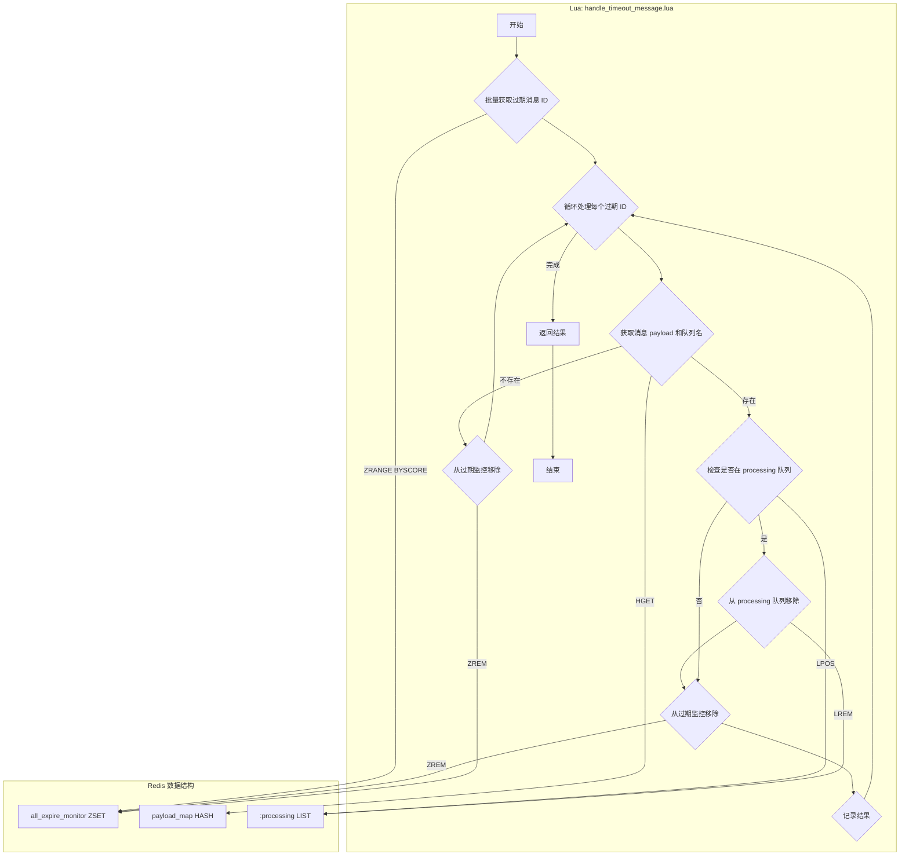

# Lua Script: handle_timeout_message.lua

## 1. 功能概述

`handle_timeout_message.lua` 脚本是系统可靠性的重要保障。它由一个后台监控服务定期调用，用于批量发现和处理那些“卡死”在 `processing` 队列中超时的消息。脚本会检查这些消息，将它们从 `processing` 队列和过期监控中移除，并返回给调用方进行后续处理（通常是重试或移入死信队列）。

## 2. 设计原理

该脚本利用一个全局的有序集合 `all_expire_monitor` 来工作。每当一个消息从 `pending` 队列移动到 `processing` 队列时，分发服务就会向这个 ZSet 中添加一个成员，其 `value` 是消息 ID，`score` 是该消息的过期时间戳。本脚本通过 `ZRANGE ... BYSCORE` 查询所有 `score` 小于等于当前时间的成员，从而高效地找出所有超时的消息。

### 2.1 数据结构关系图



## 3. 数据结构详解

`handle_timeout_message.lua` 脚本是系统的“清道夫”，负责识别和回收那些卡在“处理中”状态超时的消息。它依赖于以下三种数据结构来完成这个关键的容错任务。

### 3.1 数据结构定义

1.  **全局过期监控集合 (all_expire_monitor)**
    *   **类型**: Redis Sorted Set (ZSet)
    *   **用途**: 这是超时检测的核心。每当消息进入 `processing` 队列时，一个带有过期时间戳的 `message_id` 就会被添加到此 ZSet。本脚本通过 `ZRANGEBYSCORE` 查询所有 `score` 小于当前时间的成员，从而高效地批量发现所有理论上已经超时的消息。

2.  **处理中任务队列 (<topic>:processing)**
    *   **类型**: Redis List
    *   **用途**: 这是需要被检查和清理的目标。对于每个从 `all_expire_monitor` 中找到的超时 `message_id`，脚本需要确认它是否 **仍然** 存在于这个 List 中。如果存在，说明消息确实卡死了，脚本会用 `LREM` 将其移除。

3.  **消息内容存储 (payload_map)**
    *   **类型**: Redis Hash
    *   **用途**: 用于获取超时消息的上下文信息。在将超时消息返回给上层服务之前，脚本需要从这个 Hash 中读取消息的 `payload` 和它所属的 `queue`，以便上层服务决定如何处理它（例如，根据 `retry_count` 判断是重试还是移入死信队列）。

### 3.2 选择原因说明

*   **为什么使用 ZSet 进行超时监控？**
    *   **高效的批量查询**: 与延时任务调度类似，使用 ZSet 的 `ZRANGEBYSCORE` 是发现大量超时任务最高效的方式 (O(log N + M))。这使得监控服务可以以很低的成本定期运行，而不会对 Redis 造成大的性能压力。
    *   **全局统一视图**: 将所有队列的超时监控信息都放在一个全局的 ZSet 中，极大地简化了系统设计。只需要一个后台任务来扫描这一个 ZSet，就可以处理所有队列的超时情况，而无需为每个队列都启动一个独立的监控进程。

*   **为什么在清理前要用 `LPOS` 检查 `processing` 队列？**
    *   **提高精确性，避免误判**: 这是一个关键的健壮性设计。一个消息在 `all_expire_monitor` 中显示超时，但它可能已经刚刚被消费者正常处理完毕（`complete_message.lua` 已执行，从 `processing` List 中移除了它，但 `ZREM` `all_expire_monitor` 这一步还没来得及执行或失败了）。
    *   通过 `LPOS` 先检查 `message_id` 是否还在 `processing` List 中，脚本可以精确地判断：
        *   **如果在**: 说明消息真的卡死了，需要被回收。
        *   **如果不在**: 说明消息很可能已经处理完了，只是 `all_expire_monitor` 中的清理有延迟。此时，脚本只需安静地清理 `all_expire_monitor` 中的残留数据即可，而不会错误地将一个已完成的任务再次投入重试流程。

*   **为什么脚本只“取出”而不“处理”？**
    *   **职责分离**: 超时后的处理逻辑可能很复杂（例如，需要检查重试次数、根据错误类型决定是立即重试还是延迟重试、或者移入死信队列）。将这些复杂的业务逻辑放在上层的 Python/Go/Java 服务中实现，比放在 Lua 脚本中要容易得多，也更易于维护和测试。
    *   **保持 Lua 脚本的通用性**: Lua 脚本的核心优势在于原子性和高性能。让它专注于“原子性地、安全地从 Redis 中取出超时消息”这一核心任务，可以使脚本保持简洁、高效和通用。上层应用可以根据需要灵活地编排后续处理流程。

## 4. 设计优势

- **批量处理**: 与 `process_delay_message.lua` 类似，该脚本采用批量处理的方式，一次性获取并处理多个超时消息，大大提高了监控和恢复的效率。
- **原子性恢复**: 脚本原子性地将消息从 `processing` 队列和 `expire_monitor` 中移除。这可以防止多个监控实例对同一个超时消息进行重复处理。
- **自我修复和鲁棒性**: 脚本能够处理数据不一致的情况。例如：
    - 如果一个消息在 `expire_monitor` 中存在，但在 `payload_map` 中已被删除，脚本会安全地将其从 `expire_monitor` 中清理掉。
    - 如果一个消息在 `expire_monitor` 中超时，但已不在 `processing` 队列中（可能已被成功处理但 `complete_message` 失败），脚本也能正确地将其从 `expire_monitor` 中移除。
- **职责分离**: 脚本只负责“发现”和“安全地取出”超时消息，而将“如何处理”（重试还是死信）的决策权交给了上层的 Python 服务。这种设计使得脚本更通用，上层逻辑更灵活。

## 5. 核心流程图

```mermaid
sequenceDiagram
    participant Monitor as 监控服务
    participant Lua as handle_timeout_message.lua
    participant Redis as Redis
    participant Lifecycle as 生命周期服务

    Monitor->>Lua: 定期调用脚本 (target_time, batch_size)

    Lua->>Redis: ZRANGE all_expire_monitor 0 <target_time> BYSCORE LIMIT 0 <batch_size>
    Redis-->>Lua: 过期的消息ID列表

    loop 对每个过期的消息ID
        Lua->>Redis: HGET payload_map <msg_id>
        Lua->>Redis: HGET payload_map <msg_id>:queue
        Redis-->>Lua: payload, queue_name
        alt 消息存在
            Lua->>Redis: LPOS <queue_name>:processing <msg_id>
            Redis-->>Lua: position
            if position is not null
                Lua->>Redis: LREM <queue_name>:processing 1 <msg_id>
            end
            Lua->>Redis: ZREM all_expire_monitor <msg_id>
        else 消息不存在
            Lua->>Redis: ZREM all_expire_monitor <msg_id>
        end
    end

    Lua-->>Monitor: 返回超时消息的详细信息列表
    Monitor->>Lifecycle: 逐个处理超时消息 (retry or move_to_dlq)
```

## 6. 重要设计要点

- **`LPOS` 的使用**: 在 `LREM` 之前使用 `LPOS` 检查消息是否存在于 `processing` 队列中，这是一个重要的优化。`LREM` 操作会遍历列表，而 `LPOS` 同样需要遍历，但它能提前确认消息是否存在，避免在消息已被正常处理的情况下仍然执行 `LREM`。更重要的是，它能区分消息是“真的卡死”还是“已经处理完成但监控信息未清理”。
- **与 `complete_message.lua` 的协同**: `complete_message.lua` 的成功执行是避免消息被本脚本错误处理的关键。如果 `complete_message` 失败，本脚本就充当了最终的“清道夫”角色，保证了系统的可靠性。
