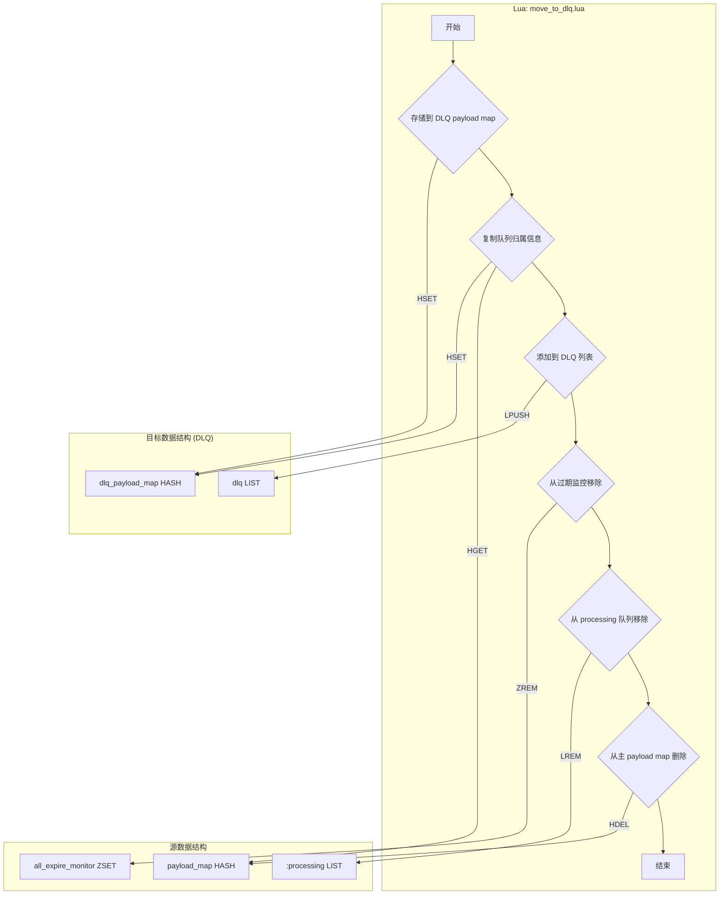
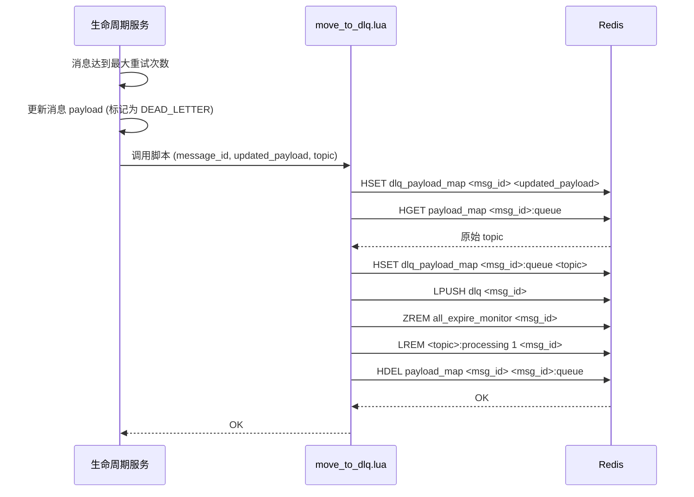

# Lua Script: move_to_dlq.lua

## 1. 功能概述

`move_to_dlq.lua` 脚本负责将一条消息从其正常的生命周期中移除，并原子性地迁移到死信队列（Dead-Letter Queue, DLQ）。这通常发生在消息达到最大重试次数后，或者遇到了一个不可恢复的错误时。

## 2. 设计原理

该脚本的设计思想是“归档并清理”。它将消息的最终状态（包含所有错误信息和重试历史的 payload）保存到一个专门用于死信的哈希表（`dlq_payload_map`）和列表（`dlq`）中，然后从所有活跃的 Redis 数据结构（`payload_map`, `expire_monitor`, `processing` 队列）中彻底清除该消息的所有痕迹。

### 2.1 数据结构关系图

## 3. 设计优势

- **原子性迁移**: 脚本将“存入死信区”和“从活跃区删除”两个过程合并为一次原子操作。这保证了消息不会在迁移过程中丢失，也避免了消息被成功移入死信队列后，仍然被系统（如超时监控）错误地处理。
- **数据隔离**: 死信消息被存储在独立的 `dlq_payload_map` 和 `dlq` 中，与正常的消息流完全隔离。这使得对死信队列的监控、管理和分析变得非常简单，不会干扰到主系统的性能。
- **信息完整性**: 脚本不仅移动了消息的 payload，还复制了它的队列归属信息（`<msg_id>:queue`）。这保留了消息的完整上下文，便于后续的人工排查或自动修复程序了解该消息的来源。
- **彻底清理**: 脚本确保了消息在原始 `payload_map`、`expire_monitor` 和 `processing` 队列中的所有相关数据都被彻底删除，释放了 Redis 内存，并维护了系统的整洁性。

## 4. 核心流程图

## 5. 重要设计要点

- **与 `complete_message.lua` 的对比**: `complete_message.lua` 是“成功删除”，而 `move_to_dlq.lua` 是“失败归档”。前者不保留任何数据，后者则将最终状态持久化到死信区。
- **`processing` 队列的清理**: 与 `retry_message.lua` 一样，从 `processing` 队列中移除消息是确保状态一致性的关键步骤。
- **死信队列的管理**: 该脚本只负责“入队”。死信队列中的消息如何被处理（例如，通过一个独立的管理工具查看、重发或删除）是系统另一个层面的功能。
