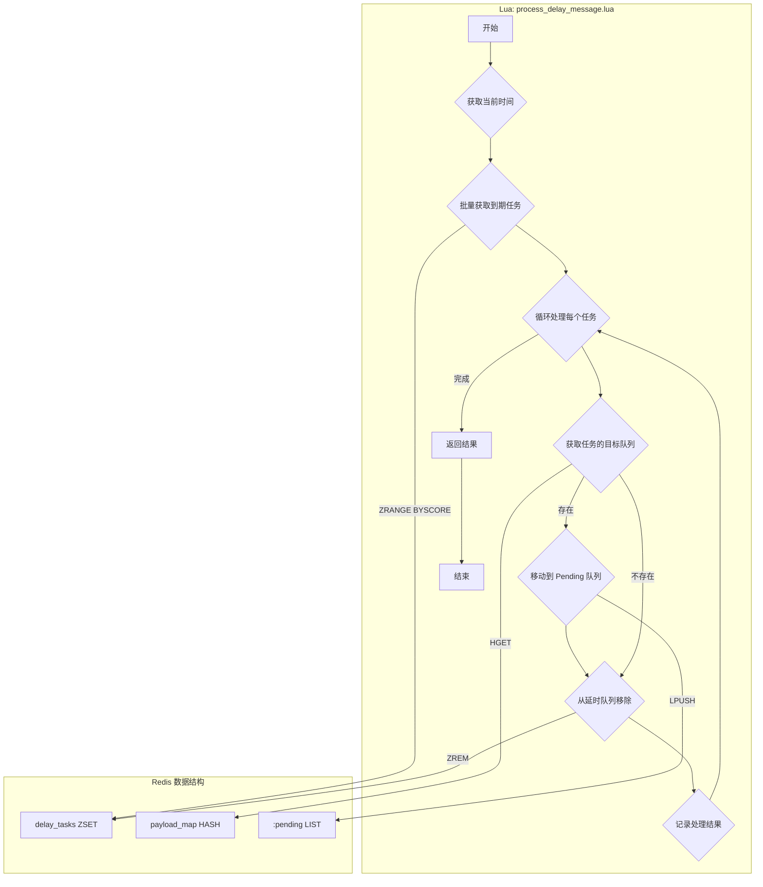
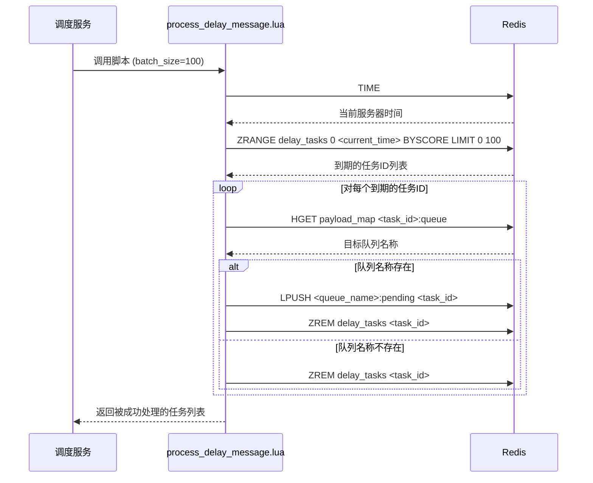

# Lua Script: process_delay_message.lua

## 1. 功能概述

`process_delay_message.lua` 脚本负责处理所有已到期的延时任务。它查询延时任务队列（`delay_tasks` ZSet），将所有执行时间小于等于当前时间的任务批量移动到它们各自的目标普通队列（`pending` List）中，以供消费者后续处理。

## 2. 设计原理

该脚本的核心是批量处理和原子性。它使用 `ZRANGE ... BYSCORE` 命令一次性获取所有到期的任务，然后在一个循环中将它们逐个移动到正确的 `pending` 队列，并从 `delay_tasks` ZSet 中移除。所有这些操作都在一个脚本中完成，以保证原子性。

### 2.1 数据结构关系图

## 3. 数据结构详解

`process_delay_message.lua` 是延时任务的执行引擎。它原子性地将一批到期的延时任务转移到它们各自的待处理队列中，这个过程涉及三种核心数据结构。

### 3.1 数据结构定义

1.  **延时任务集合 (delay_tasks)**
    *   **类型**: Redis Sorted Set (ZSet)
    *   **用途**: 这是任务的来源。脚本使用 `ZRANGEBYSCORE` 命令，高效地查询出所有 `score` (执行时间) 小于等于当前时间的 `message_id`。处理完毕后，这些 `message_id` 会被 `ZREM` 命令从此 ZSet 中移除。

2.  **消息内容存储 (payload_map)**
    *   **类型**: Redis Hash
    *   **用途**: 作为一个只读的元数据源。对于每个从 `delay_tasks` 中取出的 `message_id`，脚本需要查询这个 Hash 表（`HGET {message_id}:queue`）来确定它应该被投递到哪个具体的 `pending` 队列。

3.  **待处理任务队列 (<topic>:pending)**
    *   **类型**: Redis List
    *   **用途**: 这是任务的目标。在确定了目标队列名称后，脚本使用 `LPUSH` 命令将 `message_id` 推入相应的 `pending` List，等待消费者前来获取。

### 3.2 选择原因说明

*   **为什么是 ZSet -> Hash -> List 的流向？**
    *   **职责分离**: 这种数据流清晰地体现了系统的分层设计：
        1.  `delay_tasks` (ZSet) 负责 **调度**：决定哪些任务到期了。
        2.  `payload_map` (Hash) 负责 **路由**：提供元数据，决定任务该去哪里。
        3.  `<topic>:pending` (List) 负责 **执行**：作为缓冲队列，等待消费者处理。
    *   **性能优化**:
        *   从 ZSet 中批量获取 (O(log N + M)) 远比逐个获取高效。
        *   通过 `message_id` 在 Hash 中查找路由信息是 O(1) 的快速操作。
        *   向 List 的头部 `LPUSH` 也是 O(1) 的快速操作。
    *   这个组合在保证功能的前提下，实现了高性能的批量处理。

*   **为什么批量处理和原子性至关重要？**
    *   **高吞吐量**: 在消息高峰期，可能同一时间有成百上千个任务到期。如果一次只处理一个，调度器会因频繁的网络交互和命令调用而成为瓶颈。批量处理（`ZRANGE` + Lua 循环）将开销分摊，极大地提高了吞吐量。
    *   **防止重复处理**: 想象一下，如果没有原子性，一个调度器实例查询到了一批任务，但在处理到一半时崩溃了。这些未被完全处理（即未从 `delay_tasks` 中删除）的任务，在下一次扫描时会被另一个调度器实例再次获取，导致重复投递。
    *   **Lua 的保障**: 将“批量查询-循环投递-批量删除”的整个过程封装在单个 Lua 脚本中，可以确保这批任务被视为一个整体进行处理。一旦脚本开始执行，就不会被中断，从而杜绝了多实例竞争和重复处理的风险。

## 4. 设计优势

- **批量处理 (Batch Processing)**: 这是该脚本最大的优点。它不是一次只处理一个任务，而是通过 `ZRANGE` 和 `LIMIT` 参数一次性获取一批到期的任务。这极大地减少了与 Redis 的网络往返次数，在高负载情况下能显著提升系统的吞吐量。
- **原子性保证**: 将“查询”、“移动”、“删除”三个步骤放在一个脚本中，确保了处理过程的原子性。这可以防止一个任务被多个调度器实例重复处理，或者在移动过程中因系统崩溃而导致任务丢失。
- **鲁棒性**: 脚本会检查消息的元数据（`payload_map` 中的队列信息）是否存在。如果一个延时任务的元数据已被删除（可能因为消息被手动清理），脚本会安全地将其从延时队列中移除，而不会出错，保证了系统的健壮性。
- **高效查询**: `ZRANGE ... BYSCORE` 是为这种“按分数范围查询”场景专门优化的命令，时间复杂度为 O(log N + M)，其中 N 是 ZSet 的总大小，M 是返回结果的数量。对于批量处理大量到期任务的场景，性能非常高。

## 5. 核心流程图

## 6. 重要设计要点

- **与 `get_next_delay_task.lua` 的关系**: `get_next_delay_task.lua` 决定了“何时”调用本脚本，而本脚本负责“如何”处理到期的任务。
- **幂等性**: 即使脚本被重复执行（例如，在网络重试的情况下），由于 `ZREM` 命令的特性，一个任务只会被成功地从 `delay_tasks` ZSet 中移除一次，保证了操作的幂等性。
- **返回结果**: 脚本返回一个包含 `[task_id, queue_name]` 的列表，这对于调用方进行日志记录和监控非常有用。
