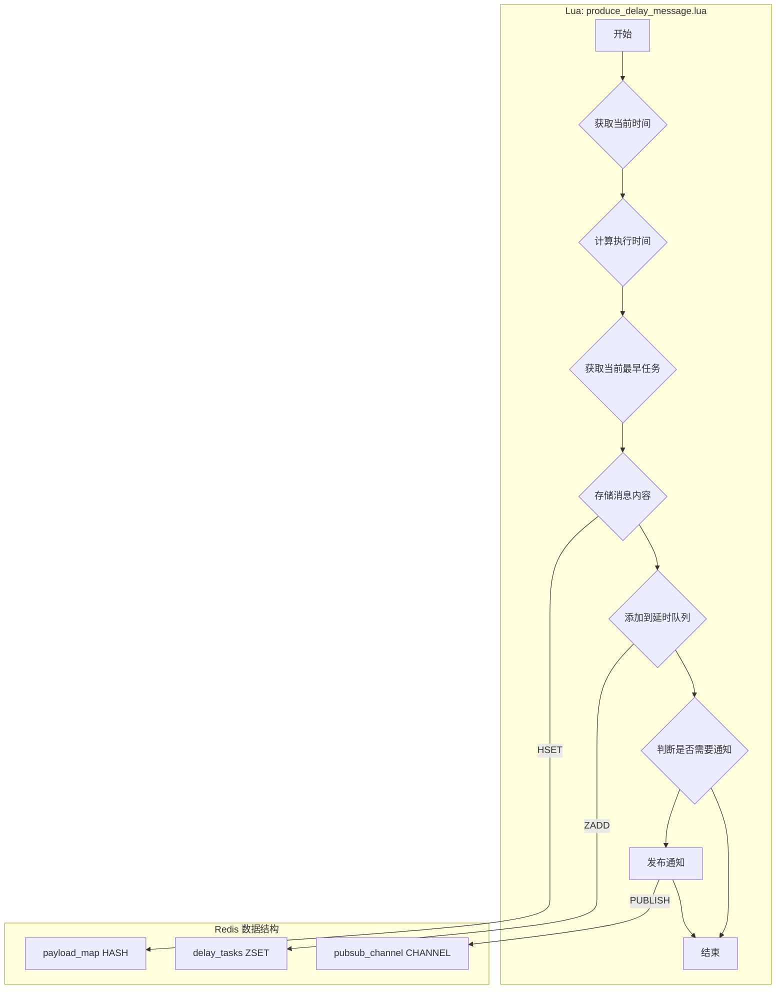
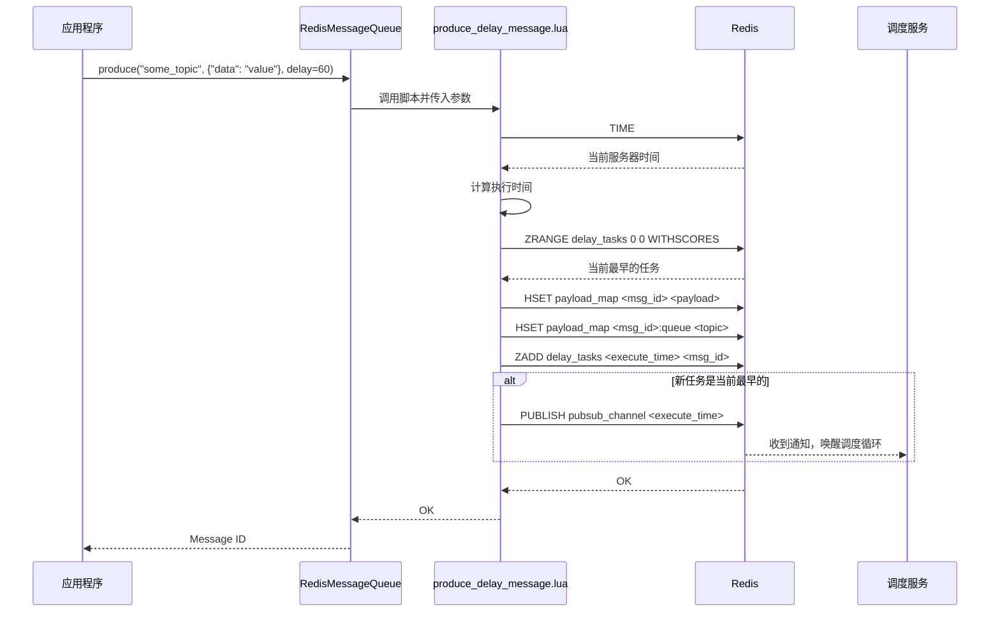

# Lua Script: produce_delay_message.lua

## 1. 功能概述

`produce_delay_message.lua` 脚本用于原子性地生产一条延时消息。它将消息内容存入 Redis，并将消息的执行时间记录在一个有序集合（ZSet）中，同时通过发布/订阅（Pub/Sub）机制智能地通知调度器。

## 2. 设计原理

该脚本的核心是利用 Redis 的 ZSet 数据结构来管理延时任务。ZSet 的 score 存储任务的执行时间戳，value 存储任务的 ID。通过这种方式，可以高效地查询和获取即将到期的任务。

### 2.1 数据结构关系图

## 3. 数据结构详解

`produce_delay_message.lua` 脚本是延时消息功能的入口。它精心设计了三种数据结构，以实现高效、可靠的延时消息生产和智能调度唤醒。

### 3.1 数据结构定义

1.  **延时任务集合 (delay_tasks)**
    *   **类型**: Redis Sorted Set (ZSet)
    *   **结构**:
        *   `key`: `mx-rmq:{queue_name}:delay_tasks`
        *   `score`: `execute_time` (任务的毫秒级执行时间戳)
        *   `member`: `message_id`
    *   **用途**: 存储所有待执行的延时任务。ZSet 的 `score` 天然地为任务提供了按执行时间排序的能力，是实现延时功能的基石。

2.  **消息内容存储 (payload_map)**
    *   **类型**: Redis Hash
    *   **结构**:
        *   `key`: `mx-rmq:{queue_name}:payload`
        *   `field`: `message_id`
        *   `value`: `message_payload`
        *   `field`: `{message_id}:queue`
        *   `value`: `target_topic_name`
    *   **用途**: 与普通消息一样，用于存储消息的完整内容和其最终被投递的目标队列名。

3.  **调度器唤醒通道 (delay_wakeup_channel)**
    *   **类型**: Redis Pub/Sub Channel
    *   **结构**:
        *   `channel_name`: `mx-rmq:{queue_name}:delay_wakeup`
        *   `message`: `new_execute_time`
    *   **用途**: 这是一个轻量级的通知机制。当一个新加入的延时任务比当前所有任务都更早执行时，脚本会通过此通道发布一条消息，以“唤醒”可能正在休眠的调度器，使其重新评估等待时间。

### 3.2 选择原因说明

*   **为什么使用 ZSet + Hash 的组合？**
    *   **性能与职责分离**: 这是本系统的一个核心设计模式。
        *   **ZSet (`delay_tasks`)** 只存储用于调度和排序的最小信息（`message_id` 和 `execute_time`）。这使得 ZSet 非常紧凑，排序、添加、删除等操作都非常快。
        *   **Hash (`payload_map`)** 存储重量级的消息体。只有当任务到期并被实际处理时，系统才会通过 `message_id` (O(1) 复杂度) 去查询其内容。
    *   这种分离设计避免了在 ZSet 中存储大量冗余数据，极大地提升了延时任务调度的性能和内存效率。

*   **为什么需要“智能通知” (Pub/Sub)？**
    *   **避免无效轮询**: 如果没有通知机制，调度器将不得不以固定的频率（例如每秒）去轮询 `delay_tasks` ZSet，检查是否有新任务或任务到期。在任务不频繁的系统中，这会产生大量的、99% 都是无效的 Redis 查询，浪费 CPU 和网络资源。
    *   **事件驱动的高效唤醒**: Pub/Sub 实现了一种高效的事件驱动模型。调度器可以长时间地、低功耗地“睡眠”（通过 `asyncio.Event.wait()`）。只有当一个 **可能改变其等待决策** 的事件发生时（即一个更早的任务被添加），生产者才会通过 Pub/Sub 发送一条通知来唤醒它。
    *   **“智能”在哪里？**: 智能之处在于，它 **并非** 为每个延时消息都发送通知。只有当新任务的执行时间早于当前 ZSet 中最早的时间，或者 ZSet 原本为空时，才会发送通知。这进一步过滤掉了大量不必要的唤醒，实现了“非必要，勿打扰”的极致优化。

## 4. 设计优势

- **原子性与高性能**: 与普通消息生产一样，所有操作在单个脚本中完成，保证了原子性和高性能。
- **精确定时**: 使用 Redis 服务器时间（`TIME` 命令）计算执行时间戳，避免了客户端与服务器之间时钟不同步的问题。
- **智能通知 (Smart Notification)**: 这是该脚本最核心的设计优点。它不会为每一个新生产的延时消息都发送通知，而是仅在以下关键时刻发送：
    1.  **队列为空**: 当延时队列中没有任何任务时，新加入的任务必须触发一次调度。
    2.  **新任务更早**: 当新加入的任务比当前所有待处理任务的执行时间都早时，需要唤醒调度器以重新计算等待时间。
    3.  **处理已到期任务**: 如果检查发现已有任务到期，也会触发通知，确保到期任务能被及时处理。
    这种机制极大地减少了无效的 Pub/Sub 消息，降低了网络开销和调度器的CPU消耗。

## 5. 核心流程图

## 6. 重要设计要点

- **时间单位**: 脚本内部统一使用毫秒时间戳进行计算，以保证精度。
- **无锁化**: 整个流程不依赖任何分布式锁，通过 ZSet 的有序性和原子操作来保证数据一致性，具有很高的并发性能。
- **解耦**: 生产者只负责将任务放入延时队列，并通过 Pub/Sub 发出信号。它不关心调度器如何工作，实现了生产者与调度器的完全解耦。
