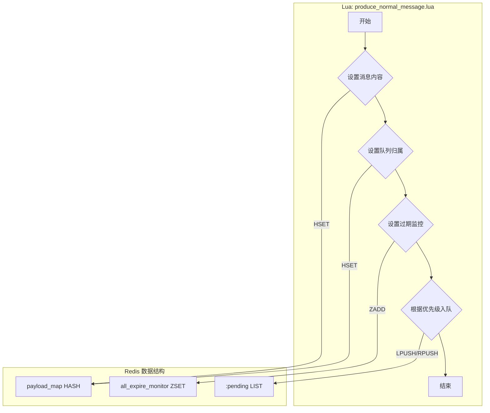
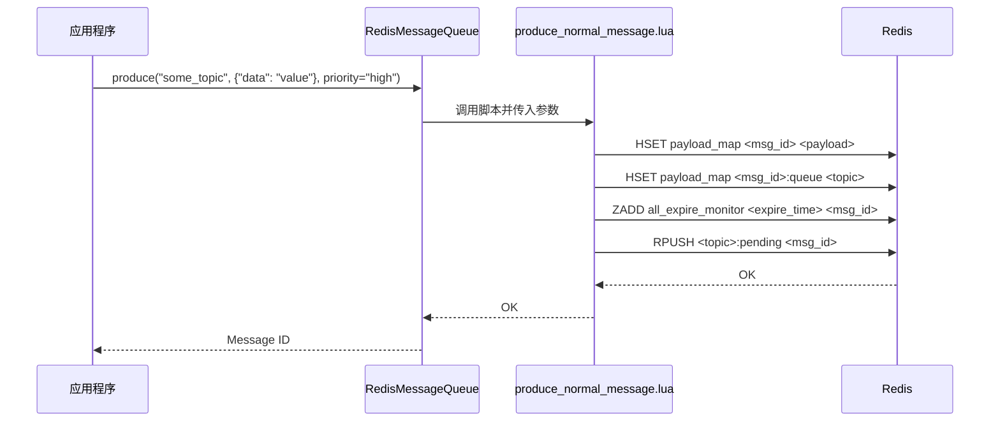

# Lua Script: produce_normal_message.lua

## 1. 功能概述

`produce_normal_message.lua` 脚本负责原子性地生产一条普通（非延时）消息。它将消息的所有必要信息写入 Redis，确保消息的持久化和后续处理的可靠性。

## 2. 设计原理

该脚本遵循“一次写入，全部成功”的原子性原则。通过单个 Lua 脚本执行所有 Redis 命令，避免了多次网络往返带来的延迟和潜在的数据不一致风险。

### 2.1 数据结构关系图

## 3. 数据结构详解

脚本 `produce_normal_message.lua` 精心设计并使用了以下三种 Redis 数据结构，以确保消息生产的高效性和可靠性。

### 3.1 数据结构定义

1.  **消息内容存储 (payload_map)**
    *   **类型**: Redis Hash
    *   **结构**:
        *   `key`: `mx-rmq:{queue_name}:payload`
        *   `field`: `message_id`
        *   `value`: `message_payload` (序列化后的消息体)
        *   `field`: `{message_id}:queue`
        *   `value`: `topic_name` (消息归属的队列主题)
    *   **用途**: 作为一个中央存储库，保存消息的完整内容以及它所属的队列信息。

2.  **待处理任务队列 (<topic>:pending)**
    *   **类型**: Redis List
    *   **结构**:
        *   `key`: `mx-rmq:{topic_name}:pending`
        *   `element`: `message_id`
    *   **用途**: 这是每个主题（Topic）的核心任务队列。生产者将 `message_id` 推入此列表，消费者从列表中拉取 `message_id` 进行处理。

3.  **全局过期监控集合 (all_expire_monitor)**
    *   **类型**: Redis Sorted Set (ZSet)
    *   **结构**:
        *   `key`: `mx-rmq:all_expire_monitor`
        *   `score`: `expire_time` (消息的毫t秒级过期时间戳)
        *   `member`: `message_id`
    *   **用途**: 统一监控所有消息的过期时间。一个后台任务会定期扫描此 ZSet，处理那些已经过期但仍未被成功消费的消息（例如，将其移入死信队列）。

### 3.2 选择原因说明

*   **为什么使用 Hash 存储消息内容和元数据?**
    *   **O(1) 复杂度的快速访问**: Hash 结构允许我们通过 `message_id` 以 O(1) 的时间复杂度快速存取消息的完整内容和其归属的队列。
    *   **关联数据聚合**: 将消息体 (`payload`) 和它的队列归属信息 (`{message_id}:queue`) 存储在同一个 Hash 中，简化了数据管理。当需要清理或查询一个消息的完整信息时，只需操作这一个 `key` 即可。
    *   **内存效率**: 相比于为每个消息的每个属性都创建一个独立的 Redis `key`，使用 Hash 可以更有效地利用内存，尤其是在消息量巨大时。

*   **为什么使用 List 作为待处理任务队列?**
    *   **FIFO/LIFO 队列的简单实现**: Redis List 是实现标准队列（先进先出 FIFO）或栈（后进先出 LIFO）的理想选择。我们利用 `LPUSH`（左推）和 `RPUSH`（右推）的组合，巧妙地实现了优先级队列。普通消息 `LPUSH` 入队，高优消息 `RPUSH` 入队，而消费者统一从 `RPOP`（右弹）消费，确保了高优消息总是被优先处理。
    *   **阻塞操作支持**: List 支持 `BRPOP` 等阻塞操作，这使得消费者可以在队列为空时高效地等待新任务，而无需进行空轮询，极大地降低了延迟和资源消耗。
    *   **原子性操作**: `LPUSH`, `RPUSH`, `RPOP` 等都是原子操作，保证了多生产者和多消费者并发操作队列时的数据一致性。

*   **为什么使用 Sorted Set (ZSet) 进行全局过期监控?**
    *   **高效的过期排序**: ZSet 能够根据 `score`（我们用过期时间戳）对所有消息进行高效排序。这使得查找并处理所有已过期消息的操作变得非常高效（通过 `ZRANGEBYSCORE`），只需一次查询即可获取所有到期的 `message_id`。
    *   **全局统一处理**: 将所有队列的消息过期时间都存储在同一个 ZSet 中，可以用一个统一的后台任务来处理所有队列的过期逻辑，简化了系统设计和运维。如果为每个队列都创建一个独立的过期 ZSet，管理和扫描的成本会高得多。
    *   **动态更新**: ZSet 允许轻松地添加、删除或更新成员的 `score`，这在消息被成功消费后（需要从过期监控中移除）或需要更新其过期时间时非常有用。

## 4. 设计优势

- **原子性**: 所有操作封装在单个脚本中，保证了消息生产的原子性。如果任何一步失败，整个操作都不会提交，避免了产生不完整或无效的消息数据。
- **高性能**: 将多个 Redis 命令合并为一次网络请求，显著降低了网络延迟，提升了消息生产的吞吐量。
- **优先级支持**: 通过 `is_urgent` 参数，脚本可以决定将消息从队列的左侧（`LPUSH`，普通优先级）还是右侧（`RPUSH`，高优先级）推入，实现了简单的优先级队列功能。
- **数据一致性**: 脚本确保了消息内容、队列归属和过期监控三者信息的一致性，为后续的消费、重试和清理流程提供了可靠的数据基础。

## 5. 核心流程图

## 6. 重要设计要点

- **参数化**: 脚本通过 `KEYS` 和 `ARGV` 接收所有必要的参数，使其具有良好的通用性和可重用性。
- **错误处理**: Redis Lua 脚本的执行是事务性的。如果脚本在执行过程中遇到错误，所有已经执行的写命令都会被回滚，从而保证了数据的一致性。
- **优先级实现**: 利用 Redis List 的 `LPUSH` 和 `RPUSH` 命令，巧妙地实现了双端队列，高优先级消息从一端入队，消费者从同一端消费，从而实现优先处理。
