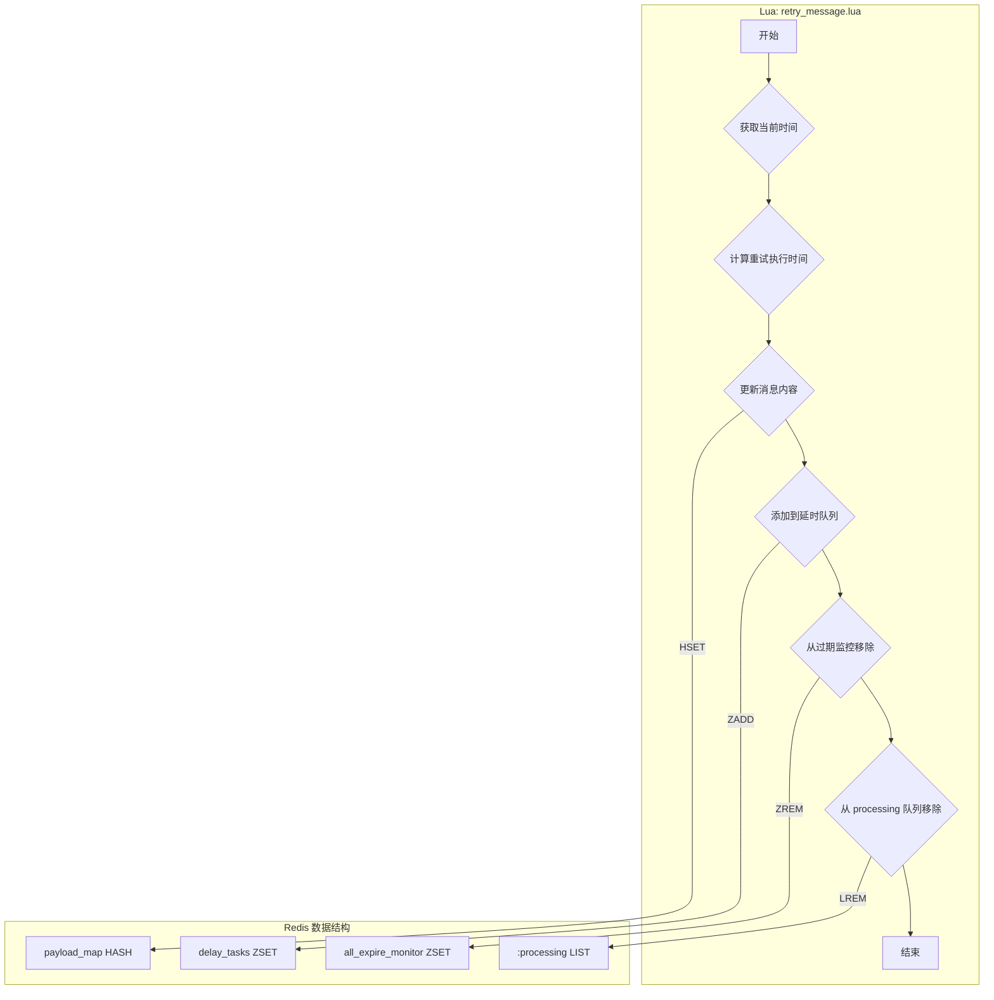
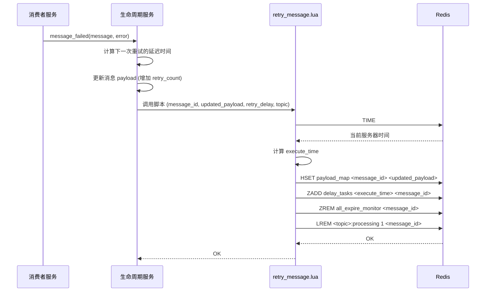

# Lua Script: retry_message.lua

## 1. 功能概述

`retry_message.lua` 脚本用于处理失败的消息，并将其重新调度以便在未来某个时间点进行重试。它会更新消息的 payload（通常是增加重试次数或记录错误信息），然后将其作为一个新的延时任务放回延时队列（`delay_tasks` ZSet），并从当前的处理中队列（`processing` List）和过期监控中移除。

## 2. 设计原理

该脚本的设计思想是将“重试”视为一次特殊的“延时生产”。它复用了延时任务的机制，通过计算一个未来的执行时间戳（`current_time + retry_delay`）并将消息重新加入 `delay_tasks` ZSet，从而实现了延迟重试的功能。同时，它必须原子性地完成状态的转换，即从“处理中”变为“等待重试”。

### 2.1 数据结构关系图

## 3. 数据结构详解

`retry_message.lua` 脚本是一个状态转换的枢纽，它原子性地将一个“处理中”的消息转变为一个“延时”消息。它涉及了系统中的四种关键数据结构。

### 3.1 数据结构定义

1.  **处理中任务队列 (<topic>:processing)**
    *   **类型**: Redis List
    *   **结构**:
        *   `key`: `mx-rmq:{topic_name}:processing`
        *   `element`: `message_id`
    *   **用途**: 存放正在处理的消息。在重试场景下，消息处理失败，必须从此队列中移除，以结束其“处理中”的状态。

2.  **全局过期监控集合 (all_expire_monitor)**
    *   **类型**: Redis Sorted Set (ZSet)
    *   **结构**:
        *   `key`: `mx-rmq:all_expire_monitor`
        *   `score`: `expire_time`
        *   `member`: `message_id`
    *   **用途**: 监控所有消息的生命周期。当一个消息被安排重试时，它原有的过期时间就失效了，必须从这个监控集合中移除。它的生命周期将由延时任务机制重新管理。

3.  **延时任务集合 (delay_tasks)**
    *   **类型**: Redis Sorted Set (ZSet)
    *   **结构**:
        *   `key`: `mx-rmq:{queue_name}:delay_tasks`
        *   `score`: `retry_execute_time` (新的执行时间)
        *   `member`: `message_id`
    *   **用途**: 这是实现延时重试的核心。脚本计算出下一次重试的时间戳，并将消息 `message_id` 以此为 `score` 添加到此 ZSet 中。延时任务调度器后续会负责在正确的时间点将其取出。

4.  **消息内容存储 (payload_map)**
    *   **类型**: Redis Hash
    *   **结构**:
        *   `key`: `mx-rmq:{queue_name}:payload`
        *   `field`: `message_id`
        *   `value`: `updated_message_payload`
    *   **用途**: 在安排重试前，通常需要更新消息的内容，例如增加一个 `retry_count` 字段或记录下最后一次失败的原因。此脚本负责将更新后的 `payload` 写回 Hash。

### 3.2 选择原因说明

*   **为什么需要原子性地操作这四个数据结构？**
    *   **保证状态转换的完整性**: 重试操作是一个复杂的状态转换：消息需要从“处理中”队列和“过期监控”中消失，同时带着更新后的内容出现在“延时队列”中。这四个步骤必须作为一个不可分割的整体来执行。
    *   **避免“幽灵”或“分裂”状态**: 如果操作不具备原子性，可能会出现危险的中间状态：
        *   **场景1**: 消息已添加到 `delay_tasks`，但还没从 `processing` List 中移除。此时，系统会认为消息既在延时等待，又在被处理，这会导致逻辑混乱和潜在的重复处理。
        *   **场景2**: 消息内容已在 `payload_map` 中更新，但加入 `delay_tasks` 失败。这会导致消息的重试次数增加了，但它却永远不会被再次执行， фактически丢失了。
    *   **Lua 的关键作用**: 通过将所有这些 `HSET`, `ZADD`, `ZREM`, `LREM` 命令封装在单个 Lua 脚本中，我们确保了整个重试状态转换的原子性，彻底杜绝了上述风险，保证了系统的健壮性。

## 4. 设计优势

- **原子性状态转换**: 脚本将“更新 payload”、“加入延时队列”、“移出过期监控”、“移出 processing 队列”这四个关键步骤合并为一次原子操作。这确保了消息状态转换的一致性，避免了消息既在 `processing` 队列又在 `delay_tasks` 队列中的“幽灵状态”。
- **复用延时机制**: 通过将重试任务重新注入延时队列，该脚本巧妙地复用了现有的延时任务调度逻辑，而无需为重试功能设计一套全新的、独立的调度机制。这降低了系统的复杂性。
- **灵活的重试策略**: 重试的延迟时间（`retry_delay`）是由调用方（Python 代码）计算并传入的。这使得实现各种复杂的重试策略（如指数退避、固定间隔、自定义延迟等）成为可能，脚本本身只负责执行，保持了通用性。

## 5. 核心流程图

## 6. 重要设计要点

- **清理 `processing` 队列**: 从 `processing` 队列中移除消息是至关重要的一步。因为它标志着该消息的本次处理尝试已经结束，并转入等待重试状态。如果缺少这一步，超时监控服务可能会错误地认为该消息仍然卡在处理中，并再次触发处理逻辑，导致混乱。
- **清理过期监控**: 同样，从 `all_expire_monitor` 中移除也是必要的。因为消息的生命周期已经通过 `delay_tasks` 重新管理，旧的过期时间不再有效。
- **时间源**: 与其他脚本一样，使用 Redis 服务器时间来保证计时的一致性和准确性。
