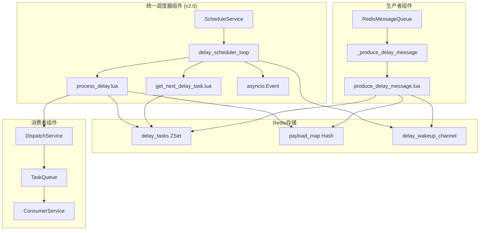
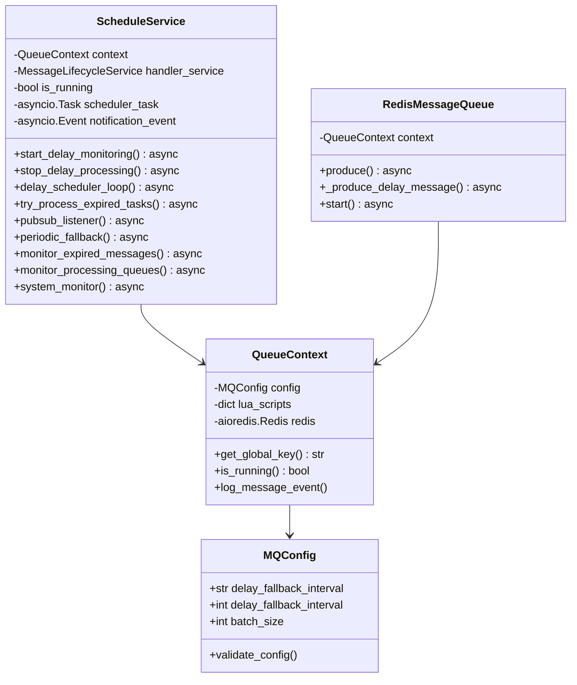
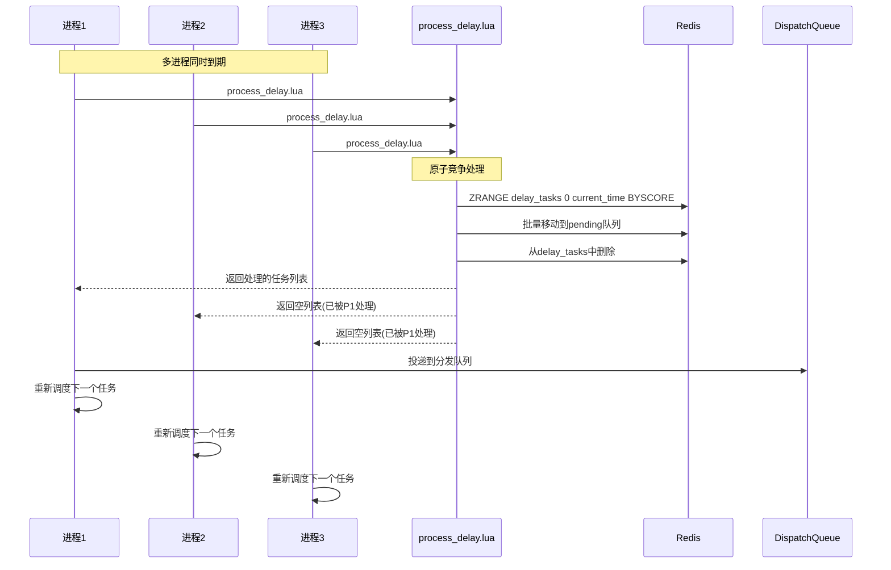
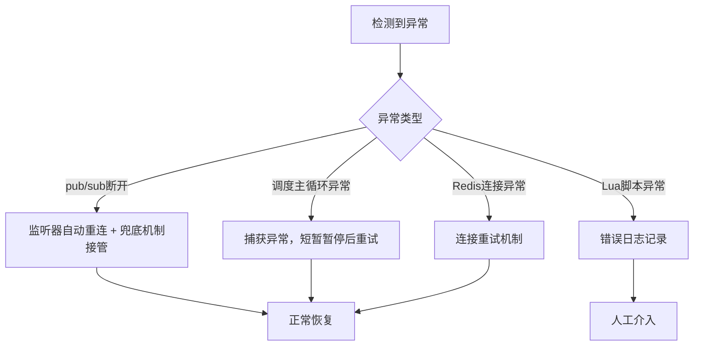

# 延时任务设计文档 (v2.0)

## 1. 概述

延时任务是消息队列系统中的重要功能，允许消息在指定时间后才被处理。本文档详细描述了 mx-rmq 中基于 `asyncio.Event` 和状态机重构后的延时任务设计与实现。

### 1.1 设计目标

- **高精度**：毫秒级延时精度，替代传统的秒级轮询
- **高可用**：分布式部署，无单点故障
- **高性能**：事件驱动架构，最小化资源消耗
- **可扩展**：支持水平扩展，自动负载均衡
- **高可靠**：简化的状态机模型，更健壮的错误处理和恢复机制

### 1.2 核心改进

从**本地定时器 + 锁**模式重构为**主循环状态机 + asyncio.Event**：

| 方面 | 旧方案 | 新方案 (v2.0) |
|------|----------|--------|
| 调度模型 | 多任务 + 锁 | 单一主循环 + Event |
| 唤醒机制 | 取消/创建任务 | `asyncio.Event.set()` |
| 可靠性 | 复杂，易出错 | 逻辑清晰，更健壮 |
| 资源消耗 | 任务切换开销 | 极低，高效等待 |

## 2. 核心组件

### 2.1 组件架构



### 2.2 核心类说明

#### ScheduleService (统一调度服务)
- **职责**：统一的调度服务，负责所有调度相关功能，采用**状态机**模型。
- **特性**：事件驱动 + 精确定时，通过 `asyncio.Event` 实现高效唤醒。
- **核心逻辑**:
  - **`delay_scheduler_loop`**: 核心调度循环，作为状态机管理任务的等待和处理。
  - **`notification_event`**: 用于唤醒调度循环，替代锁和复杂的任务管理。
  - **`pubsub_listener`**: 监听Redis通知，收到消息后仅设置`notification_event`。
  - **`periodic_fallback`**: 定期兜底，同样通过设置`notification_event`触发检查。

#### Lua脚本组件
- **get_next_delay_task.lua**：获取下一个延时任务状态 (`NO_TASK`, `WAITING`, `EXPIRED`)。
- **produce_delay_message.lua**：生产延时消息 + 智能通知。
- **process_delay.lua**：(原`process_delay_message.lua`) 批量处理到期任务。

## 3. 核心类图



## 4. 数据结构设计

为了高效、可靠地实现延时任务，我们主要依赖 Redis 的三种核心数据结构：

### 4.1 数据结构定义

1.  **延时任务集合 (delay_tasks)**
    *   **类型**: Redis Sorted Set (ZSet)
    *   **结构**:
        *   `key`: `mx-rmq:{queue_name}:delay_tasks` (全局唯一)
        *   `score`: `execute_time` (任务的毫秒级执行时间戳)
        *   `member`: `message_id` (消息的唯一ID)
    *   **用途**: 存储所有待执行的延时任务，并根据执行时间排序。

2.  **消息内容存储 (payload_map)**
    *   **类型**: Redis Hash
    *   **结构**:
        *   `key`: `mx-rmq:{queue_name}:payload` (全局唯一)
        *   `field`: `message_id` (消息的唯一ID)
        *   `value`: `message_payload` (序列化后的消息体)
    *   **用途**: 存储消息的完整内容。

3.  **唤醒通知通道 (delay_wakeup_channel)**
    *   **类型**: Redis Pub/Sub Channel
    *   **结构**:
        *   `channel_name`: `mx-rmq:{queue_name}:delay_wakeup` (全局唯一)
        *   `message`: `execute_time` (新任务的执行时间)
    *   **用途**: 用于在添加了新的、更早的延时任务时，即时唤醒正在等待的调度器。

### 4.2 选择原因说明

*   **为什么使用 Sorted Set (ZSet) 存储延时任务?**
    *   **高效的时间排序**: ZSet 根据 `score` (我们用执行时间戳) 自动对成员进行排序。这使得“获取下一个最近要执行的任务”这一核心操作 (`ZRANGE ... BYSCORE LIMIT 0 1`) 的时间复杂度仅为 O(log(N))，其中 N 是延时任务的总数。这是实现高精度、低延迟调度的关键。
    *   **快速查找与删除**: ZSet 能够高效地根据 `score` 范围查询所有已到期的任务，并快速删除它们，确保了任务处理的及时性。
    *   **成员唯一性**: ZSet 的 `member` (我们用 `message_id`) 具有唯一性，天然地防止了同一消息被重复添加。

*   **为什么使用 Hash 分离存储消息内容?**
    *   **读写性能与内存优化**: 将调度信息（执行时间）与数据（消息体）分离。ZSet 中只存储轻量的 `message_id` 和 `score`，使其结构紧凑，操作快速。重量级的消息内容仅在任务到期、需要处理时才从 Hash 中通过 `message_id` 读取（O(1)复杂度），这极大地减少了 ZSet 的内存占用和排序、移动等操作的开销。
    *   **职责清晰**: `delay_tasks` (ZSet) 专职于调度，`payload_map` (Hash) 专职于存储，使系统设计更清晰。

*   **为什么使用 Pub/Sub 进行唤醒通知?**
    *   **实时性与低资源消耗**: 当一个新任务的执行时间早于当前所有任务时，通过 Pub/Sub 发布一条通知，可以立即唤醒所有正在休眠的调度器实例。这种事件驱动模型取代了传统的固定间隔轮询，避免了大量无效的查询，显著降低了 CPU 和网络资源的消耗，实现了“无事不扰”的高效等待。
    *   **解耦与可扩展性**: Pub/Sub 模式将消息发布者（生产者）与订阅者（调度器集群）完全解耦。您可以轻松地增加或减少调度器实例（水平扩展），而无需修改通知逻辑，系统具有良好的可扩展性。

## 5. 核心流程设计

### 5.1 延时消息生产流程

(与旧版相同，此处省略)

### 5.2 延时任务调度流程 (v2.0)

```mermaid
sequenceDiagram
    participant Loop as delay_scheduler_loop
    participant Lua as get_next_delay_task.lua
    participant Redis as Redis
    participant Event as notification_event
    participant PubSub as pubsub_listener
    participant Fallback as periodic_fallback

    loop 调度循环
        Loop->>Lua: get_next_delay_task.lua
        Lua->>Redis: ZRANGE, TIME
        
        alt 没有任务 (NO_TASK)
            Lua-->>Loop: 返回 NO_TASK
            Loop->>Event: event.wait() (无限等待)
        else 任务未到期 (WAITING)
            Lua-->>Loop: 返回 WAITING + wait_time
            Loop->>Event: event.wait(timeout=wait_time)
        else 任务已过期 (EXPIRED)
            Lua-->>Loop: 返回 EXPIRED
            Loop->>Loop: 立即处理过期任务
            continue
        end
    end
    
    par pub/sub通知
        PubSub->>Event: event.set()
    and 定期兜底
        Fallback->>Event: event.set()
    and 定时器到期
        Note over Event: wait()超时
    end

    Note over Loop: 被唤醒后，循环重新开始
```

### 5.3 任务处理与竞争流程



## 6. 关键技术实现

### 6.1 精确定时与状态机

```python
async def delay_scheduler_loop(self) -> None:
    """
    核心调度循环（状态机）。
    它取代了旧的 timer_lock 和 current_timer_task 管理。
    """
    while self.is_running:
        # 1. 从Redis获取下一个任务信息和等待时间
        status, *details = await get_next_task_from_redis()

        wait_seconds: float | None = None
        if status == "NO_TASK":
            wait_seconds = None  # 无限期等待
        elif status == "WAITING":
            wait_seconds = float(details[0]) / 1000.0
        elif status == "EXPIRED":
            await self.try_process_expired_tasks()
            continue

        # 2. 等待：要么超时，要么被外部事件唤醒
        try:
            self.notification_event.clear()
            await asyncio.wait_for(
                self.notification_event.wait(), timeout=wait_seconds
            )
            # 被通知唤醒，重新评估
        except asyncio.TimeoutError:
            # 定时器到期，处理任务
            await self.try_process_expired_tasks()
```

### 6.2 智能通知机制

```lua
-- Lua侧逻辑不变：只有当新任务更早或者是第一个任务时才发送通知
local current_earliest = redis.call('ZRANGE', delay_tasks, 0, 0, 'WITHSCORES')

if #current_earliest == 0 or execute_time < tonumber(current_earliest[2]) then
    redis.call('PUBLISH', pub_sub_channel, execute_time)
end
```
```python
# Python侧逻辑简化：监听器只负责设置Event，唤醒主循环
async def pubsub_listener(self) -> None:
    # ... 连接和错误处理 ...
    async for message in pubsub.listen():
        if message["type"] == "message":
            self.notification_event.set()
```

### 6.3 兜底机制

```python
async def periodic_fallback(self) -> None:
    """定期兜底检查，防止pub/sub消息丢失"""
    while self.is_running:
        await asyncio.sleep(self.context.config.delay_fallback_interval)
        try:
            self.context.logger.debug("执行兜底检查，触发一次调度评估")
            # 简单地设置事件，唤醒主循环
            self.notification_event.set()
        except Exception as e:
            self.context.log_error("兜底检查错误", e)
```

## 7. 性能优化

(与旧版相同，此处省略)

## 8. 监控与运维

(与旧版相同，此处省略)

## 9. 使用示例

(与旧版相同，此处省略)

## 10. 故障处理

### 10.1 常见问题

| 问题 | 原因 | 解决方案 |
|------|------|----------|
| 延时任务不执行 | pub/sub连接断开 | 监听器自动重连 + 兜底机制恢复 |
| 任务重复执行 | 多进程竞争 | Lua脚本原子性保证 |
| 时间不准确 | 系统时钟偏差 | 使用Redis服务器时间 |
| 内存占用高 | 任务积压 | 增加消费者或批处理大小 |
| 调度循环异常 | 未知错误 | 主循环内有`try/except`保护，会记录错误并重试 |

### 10.2 恢复机制



## 11. 总结

增强版延时任务调度器通过以下核心技术实现了显著的性能和可靠性提升：

1.  **状态机架构**：用单一的调度循环替代了复杂的任务和锁管理，代码更清晰、健壮。
2.  **`asyncio.Event`**：作为高效的异步通知机制，解耦了各个组件。
3.  **分布式设计**：消除单点故障，支持水平扩展。
4.  **智能通知**：减少无效网络调用，优化资源使用。
5.  **精确定时**：使用Redis服务器时间，避免时钟偏差。
6.  **原子竞争**：Lua脚本保证数据一致性。
7.  **多重保障**：健壮的`pub/sub`重连和定期兜底机制，确保系统高可靠。

该设计为高并发、低延迟的延时任务处理提供了更优的解决方案。