# MX-RMQ 系统设计文档

## 文档信息
- **项目名称**: MX-RMQ (基于Redis的异步消息队列)
- **版本**: v3.0
- **文档版本**: 1.0
- **创建日期**: 2024-12-19
- **更新日期**: 2024-12-19

## 目录
1. [系统概述](#1-系统概述)
2. [架构设计](#2-架构设计)
3. [核心流程设计](#3-核心流程设计)
4. [Lua脚本设计](#4-lua脚本设计)
5. [性能优化策略](#5-性能优化策略)
6. [可靠性设计](#6-可靠性设计)
7. [扩展性设计](#7-扩展性设计)
8. [技术决策](#8-技术决策)

---

## 1. 系统概述

### 1.1 设计目标

MX-RMQ 是一个基于 Redis 的高性能异步消息队列系统，致力于解决以下核心问题：

- **高性能**: 支持 10,000+ 消息/秒的吞吐量
- **高可靠**: 保证消息不丢失，提供完整的故障恢复机制
- **易扩展**: 采用组合模式，支持功能模块的独立扩展
- **易运维**: 提供完善的监控指标和告警机制

### 1.2 核心特性

#### 功能特性
- ✅ **多种消息类型**: 普通消息、延时消息、优先级消息
- ✅ **可靠投递**: 支持消息重试、死信队列
- ✅ **监控告警**: 实时监控队列状态、处理性能
- ✅ **优雅停机**: 确保处理中的消息完成后再关闭

#### 设计限制
- ❌ **不支持消费者组**: 每个topic只能被单一消费者组负载均衡消费。如需多组消费同一消息，请在应用层实现：创建多个topic并投递多次消息

#### 技术特性
- ✅ **原子操作**: 基于 Lua 脚本保证 Redis 操作原子性
- ✅ **组合架构**: 替代 Mixin 模式，提升代码可维护性
- ✅ **异步处理**: 基于 Python asyncio 的高并发处理
- ✅ **类型安全**: 全面的类型提示和 Pydantic 数据验证

### 1.3 架构原则

#### 设计原则
1. **单一职责**: 每个模块只负责一个明确的功能
2. **组合优于继承**: 使用组合模式提升灵活性
3. **依赖注入**: 通过上下文传递依赖，便于测试
4. **早期返回**: 使用卫语句减少代码嵌套
5. **明确错误处理**: 每个异常都有对应的处理策略

#### 性能原则
1. **Redis 原子性**: 关键操作使用 Lua 脚本保证原子性
2. **批量处理**: 延时任务、过期消息采用批量处理
3. **连接复用**: 使用连接池避免频繁建连
4. **内存优化**: 合理设计数据结构减少内存占用

---

## 2. 架构设计

### 2.1 系统架构概览

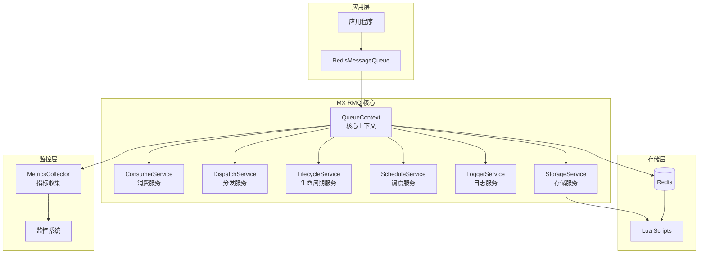
```mermaid
graph TB
    subgraph "应用层"
        App[应用程序] --> MQ[RedisMessageQueue]
    end
    
    subgraph "MX-RMQ 核心"
        MQ --> Context[QueueContext<br/>核心上下文]
        Context --> CS[ConsumerService<br/>消费服务]
        Context --> DS[DispatchService<br/>分发服务] 
        Context --> LS[LifecycleService<br/>生命周期服务]
        Context --> SS[ScheduleService<br/>调度服务]
        Context --> Logger[LoggerService<br/>日志服务]
        Context --> Storage[StorageService<br/>存储服务]
    end
    
    subgraph "存储层"
        Context --> Redis[(Redis)]
        Storage --> Scripts[Lua Scripts]
        Redis --> Scripts
    end
    
    subgraph "监控层"
        Context --> Metrics[MetricsCollector<br/>指标收集]
        Metrics --> Monitor[监控系统]
    end
```

### 2.2 组合模式设计

#### 2.2.1 设计思想

传统的 Mixin 模式存在以下问题：
- **虚空引用**: Mixin 中引用主类属性，但编译期无法验证
- **隐式依赖**: 依赖关系不明确，难以进行单元测试
- **继承耦合**: 多重继承导致紧耦合，难以扩展

组合模式的优势：
- **明确依赖**: 所有依赖通过构造函数注入
- **独立测试**: 每个服务可以独立测试
- **灵活扩展**: 可以轻松替换或扩展服务组件

#### 2.2.2 核心组件设计

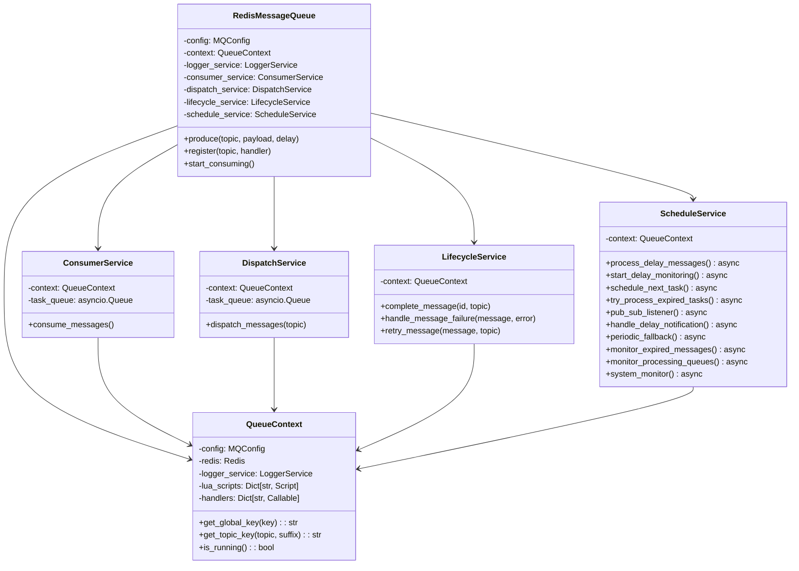
```mermaid
classDiagram
    class RedisMessageQueue {
        -config: MQConfig
        -context: QueueContext
        -logger_service: LoggerService
        -consumer_service: ConsumerService
        -dispatch_service: DispatchService
        -lifecycle_service: LifecycleService
        -schedule_service: ScheduleService
        +produce(topic, payload, delay)
        +register(topic, handler)
        +start_consuming()
    }
    
    class QueueContext {
        -config: MQConfig
        -redis: Redis
        -logger_service: LoggerService
        -lua_scripts: Dict[str, Script]
        -handlers: Dict[str, Callable]
        +get_global_key(key): str
        +get_topic_key(topic, suffix): str
        +is_running(): bool
    }
    
    class ConsumerService {
        -context: QueueContext
        -task_queue: asyncio.Queue
        +consume_messages()
    }
    
    class DispatchService {
        -context: QueueContext
        -task_queue: asyncio.Queue
        +dispatch_messages(topic)
    }
    
    class LifecycleService {
        -context: QueueContext
        +complete_message(id, topic)
        +handle_message_failure(message, error)
        +retry_message(message, topic)
    }
    
    class ScheduleService {
        -context: QueueContext
        +process_delay_messages() async
        +start_delay_monitoring() async
   
        +schedule_next_task() async
        +try_process_expired_tasks() async
        +pub_sub_listener() async
        +handle_delay_notification() async
        +periodic_fallback() async
        +monitor_expired_messages() async
        +monitor_processing_queues() async
        +system_monitor() async
    }
    
    RedisMessageQueue --> QueueContext
    RedisMessageQueue --> ConsumerService
    RedisMessageQueue --> DispatchService
    RedisMessageQueue --> LifecycleService
    RedisMessageQueue --> ScheduleService
    
    ConsumerService --> QueueContext
    DispatchService --> QueueContext
    LifecycleService --> QueueContext
    ScheduleService --> QueueContext
```

### 2.3 数据结构设计

#### 2.3.1 Redis 键名空间设计

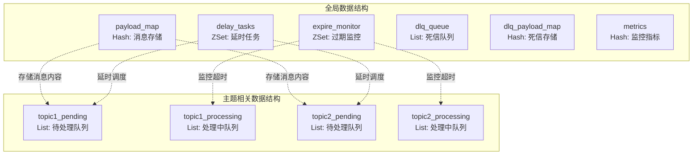
```mermaid
graph TB
    subgraph "全局数据结构"
        PM[payload_map<br/>Hash: 消息存储]
        EM[expire_monitor<br/>ZSet: 过期监控]
        DT[delay_tasks<br/>ZSet: 延时任务]
        DLQ[dlq_queue<br/>List: 死信队列]
        DLQM[dlq_payload_map<br/>Hash: 死信存储]
        METRICS[metrics<br/>Hash: 监控指标]
    end
    
    subgraph "主题相关数据结构"
        TP1[topic1_pending<br/>List: 待处理队列]
        TP2[topic1_processing<br/>List: 处理中队列]
        TP3[topic2_pending<br/>List: 待处理队列]
        TP4[topic2_processing<br/>List: 处理中队列]
    end
    
    PM -.->|存储消息内容| TP1
    PM -.->|存储消息内容| TP3
    EM -.->|监控超时| TP2
    EM -.->|监控超时| TP4
    DT -.->|延时调度| TP1
    DT -.->|延时调度| TP3
```

#### 2.3.2 消息数据模型

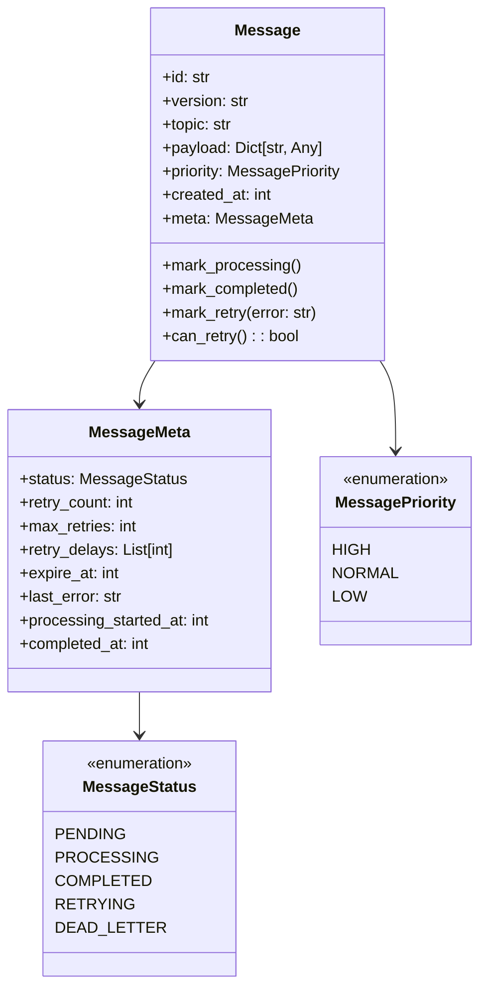
```mermaid
classDiagram
    class Message {
        +id: str
        +version: str
        +topic: str
        +payload: Dict[str, Any]
        +priority: MessagePriority
        +created_at: int
        +meta: MessageMeta
        +mark_processing()
        +mark_completed()
        +mark_retry(error: str)
        +can_retry(): bool
    }
    
    class MessageMeta {
        +status: MessageStatus
        +retry_count: int
        +max_retries: int
        +retry_delays: List[int]
        +expire_at: int
        +last_error: str
        +processing_started_at: int
        +completed_at: int
    }
    
    class MessagePriority {
        <<enumeration>>
        HIGH
        NORMAL
        LOW
    }
    
    class MessageStatus {
        <<enumeration>>
        PENDING
        PROCESSING
        COMPLETED
        RETRYING
        DEAD_LETTER
    }
    
    Message --> MessageMeta
    Message --> MessagePriority
    MessageMeta --> MessageStatus
```


### 2.4 核心数据结构

```Lua
# 消息存储
mq:payload:map             # Hash: 存储正常消息
├── {id} -> {payload}      # 消息内容
└── {id}:queue -> {topic}  # 目标队列名称

# 过期监控
mq:expire:monitor          # ZSet: 全局过期任务监控
├── score: expire_timestamp # 过期时间戳
└── value: message_id       # 消息ID

# 队列管理（每个topic一组）
{topic}:pending            # List: 待处理消息队列
{topic}:processing         # List: 处理中消息队列

# 延时任务
mq:delay:tasks             # ZSet: 全局延时任务
├── score: execute_timestamp # 执行时间戳
└── value: message_id        # 消息ID

# 死信队列
mq:dlq:queue               # List: 死信队列
mq:dlq:payload:map         # Hash: 存储死信队列消息
├── {id} -> {payload}      # 消息内容
└── {id}:queue -> {topic}  # 目标队列名称

# 解析错误存储
mq:error:parse:queue       # List: 解析错误消息队列
mq:error:parse:payload:map # Hash: 解析错误信息存储
└── {id} -> {error_info}   # 错误信息JSON，包含原始payload、错误类型、错误消息等

# 监控指标
mq:metrics                 # Hash: 系统监控指标
```


### 2.5 消息结构

```JSON
{
  "id": "uuid-v4-string",
  "version": "1.0",
  "topic": "user_registration",
  "payload": { 
    "user_id": 12345,
    "email": "user@example.com"
  },
  "created_at": 1678886400,
  "priority": "high",
  "meta": {
    "retry_count": 0,
    "max_retries": 3,
    "retry_delays": [60, 300, 1800],
    "expire_at": 1678972800
  }
}
```


---

## 3. 核心流程设计

### 3.1 消息生产流程

#### 3.1.1 普通消息生产流程

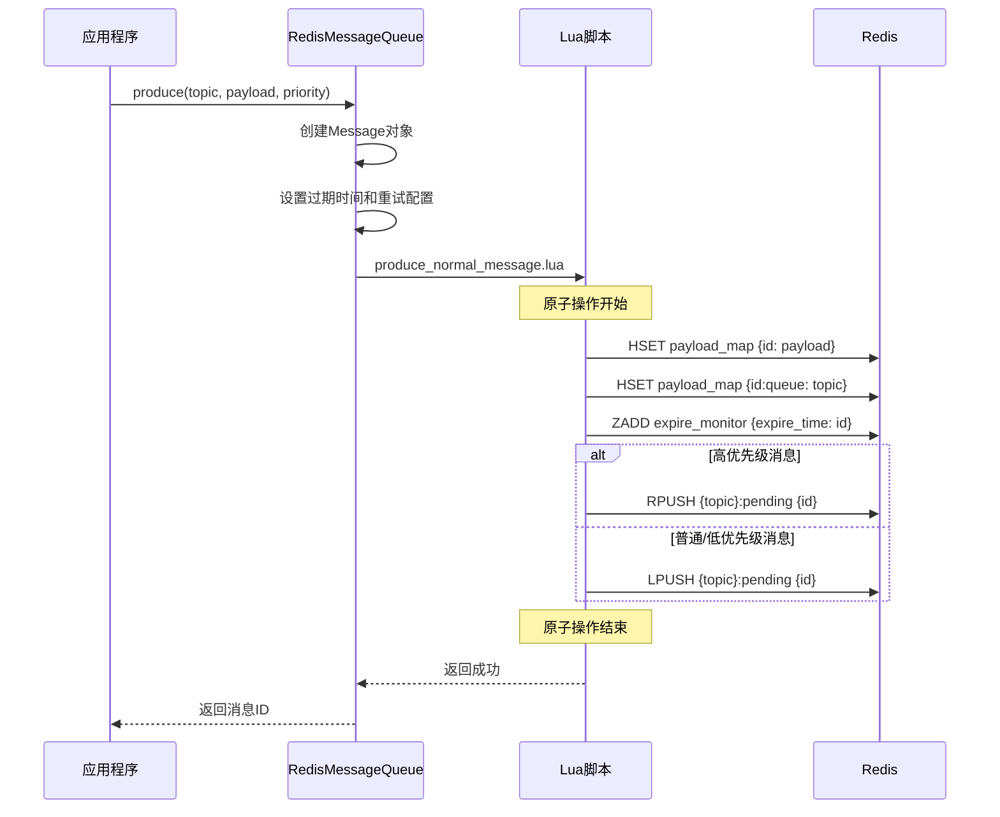
```mermaid
sequenceDiagram
    participant App as 应用程序
    participant MQ as RedisMessageQueue
    participant Lua as Lua脚本
    participant Redis as Redis
    
    App->>MQ: produce(topic, payload, priority)
    MQ->>MQ: 创建Message对象
    MQ->>MQ: 设置过期时间和重试配置
    MQ->>Lua: produce_normal_message.lua
    Note over Lua: 原子操作开始
    Lua->>Redis: HSET payload_map {id: payload}
    Lua->>Redis: HSET payload_map {id:queue: topic}
    Lua->>Redis: ZADD expire_monitor {expire_time: id}
    alt 高优先级消息
        Lua->>Redis: RPUSH {topic}:pending {id}
    else 普通/低优先级消息
        Lua->>Redis: LPUSH {topic}:pending {id}
    end
    Note over Lua: 原子操作结束
    Lua-->>MQ: 返回成功
    MQ-->>App: 返回消息ID
```

#### 3.1.2 延时消息生产流程

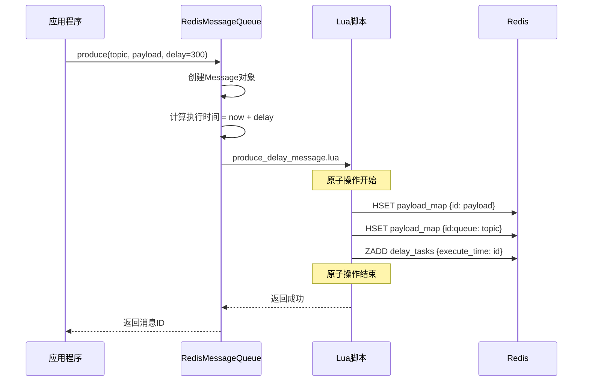
```mermaid
sequenceDiagram
    participant App as 应用程序
    participant MQ as RedisMessageQueue
    participant Lua as Lua脚本
    participant Redis as Redis
    
    App->>MQ: produce(topic, payload, delay=300)
    MQ->>MQ: 创建Message对象
    MQ->>MQ: 计算执行时间 = now + delay
    MQ->>Lua: produce_delay_message.lua
    Note over Lua: 原子操作开始
    Lua->>Redis: HSET payload_map {id: payload}
    Lua->>Redis: HSET payload_map {id:queue: topic}
    Lua->>Redis: ZADD delay_tasks {execute_time: id}
    Note over Lua: 原子操作结束
    Lua-->>MQ: 返回成功
    MQ-->>App: 返回消息ID
```

### 3.2 消息消费流程

#### 3.2.1 整体消费架构

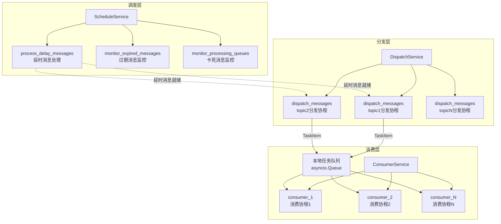
```mermaid
graph TB
    subgraph "调度层"
        SS[ScheduleService]
        SS --> PDM[process_delay_messages<br/>延时消息处理]
        SS --> MEM[monitor_expired_messages<br/>过期消息监控]
        SS --> MPQ[monitor_processing_queues<br/>卡死消息监控]
    end
    
    subgraph "分发层"
        DS[DispatchService]
        DS --> DM1[dispatch_messages<br/>topic1分发协程]
        DS --> DM2[dispatch_messages<br/>topic2分发协程]
        DS --> DMN[dispatch_messages<br/>topicN分发协程]
    end
    
    subgraph "消费层"
        TaskQueue[本地任务队列<br/>asyncio.Queue]
        CS[ConsumerService]
        CS --> C1[consumer_1<br/>消费协程1]
        CS --> C2[consumer_2<br/>消费协程2]
        CS --> CN[consumer_N<br/>消费协程N]
    end
    
    PDM -.->|延时消息就绪| DM1
    PDM -.->|延时消息就绪| DM2
    DM1 -->|TaskItem| TaskQueue
    DM2 -->|TaskItem| TaskQueue
    TaskQueue --> C1
    TaskQueue --> C2
    TaskQueue --> CN
```

#### 3.2.2 消息分发详细流程

```mermaid
sequenceDiagram
    participant DS as DispatchService
    participant Redis as Redis
    participant TQ as TaskQueue
    participant LFS as LifecycleService
    
    loop 分发循环
        DS->>Redis: BLMOVE {topic}:pending {topic}:processing
        Redis-->>DS: message_id (或超时返回None)
        
        alt 获得消息
            DS->>Redis: HGET payload_map {message_id}
            Redis-->>DS: payload_json
            
            alt 消息存在且格式正确
                DS->>DS: 解析Message对象
                DS->>Redis: ZADD expire_monitor {expire_time: message_id}
                DS->>TQ: 投递TaskItem(topic, message)
                Note over DS: 记录分发成功日志
            else 消息不存在或格式错误
                DS->>Redis: LREM {topic}:processing 1 {message_id}
                Note over DS: 记录错误并清理
            end
        else 系统关闭中
            DS->>Redis: LMOVE {topic}:processing {topic}:pending
            Note over DS: 将消息放回pending队列
            break
        end
    end
```

#### 3.2.3 消息消费详细流程

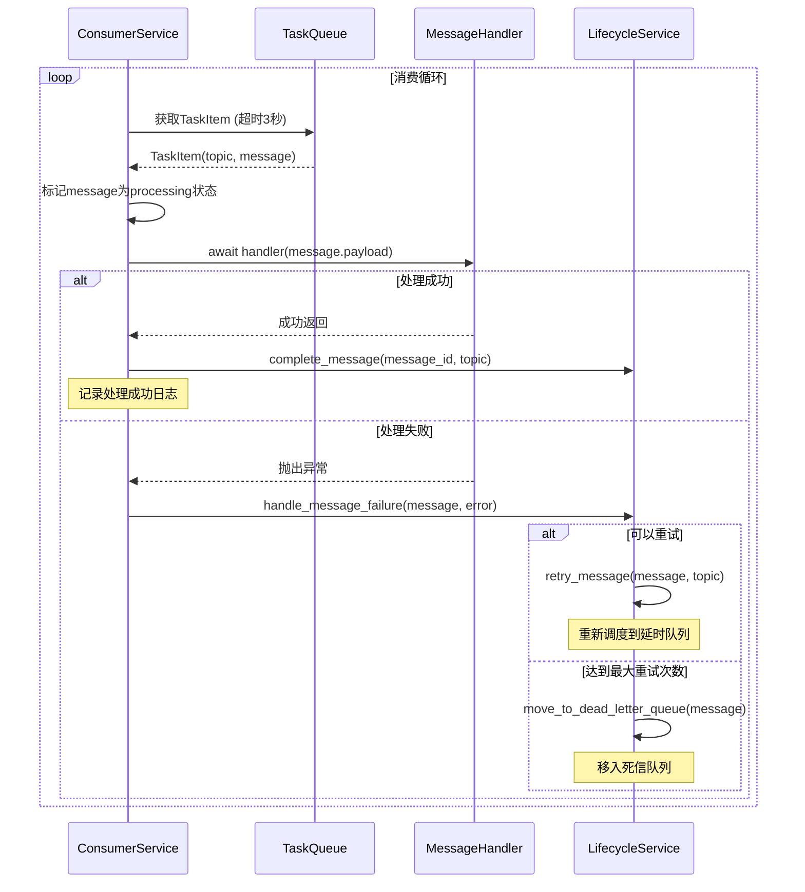
```mermaid
sequenceDiagram
    participant CS as ConsumerService
    participant TQ as TaskQueue
    participant Handler as MessageHandler
    participant LFS as LifecycleService
    
    loop 消费循环
        CS->>TQ: 获取TaskItem (超时3秒)
        TQ-->>CS: TaskItem(topic, message)
        
        CS->>CS: 标记message为processing状态
        CS->>Handler: await handler(message.payload)
        
        alt 处理成功
            Handler-->>CS: 成功返回
            CS->>LFS: complete_message(message_id, topic)
            Note over CS: 记录处理成功日志
        else 处理失败
            Handler-->>CS: 抛出异常
            CS->>LFS: handle_message_failure(message, error)
            
            alt 可以重试
                LFS->>LFS: retry_message(message, topic)
                Note over LFS: 重新调度到延时队列
            else 达到最大重试次数
                LFS->>LFS: move_to_dead_letter_queue(message)
                Note over LFS: 移入死信队列
            end
        end
    end
```

### 3.3 监控与异常处理流程

#### 3.3.1 延时消息处理流程

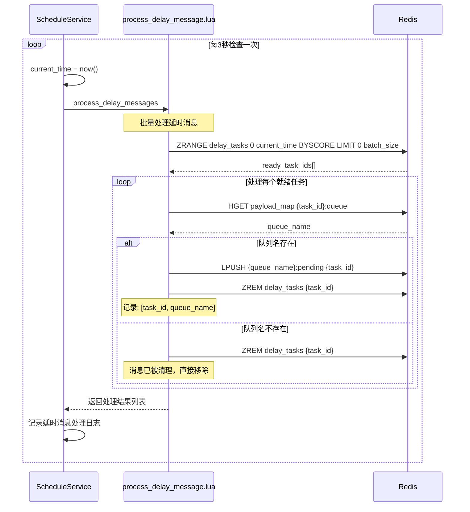
```mermaid
sequenceDiagram
    participant SS as ScheduleService
    participant Lua as process_delay_message.lua
    participant Redis as Redis
    
    loop 每3秒检查一次
        SS->>SS: current_time = now()
        SS->>Lua: process_delay_messages
        Note over Lua: 批量处理延时消息
        Lua->>Redis: ZRANGE delay_tasks 0 current_time BYSCORE LIMIT 0 batch_size
        Redis-->>Lua: ready_task_ids[]
        
        loop 处理每个就绪任务
            Lua->>Redis: HGET payload_map {task_id}:queue
            Redis-->>Lua: queue_name
            
            alt 队列名存在
                Lua->>Redis: LPUSH {queue_name}:pending {task_id}
                Lua->>Redis: ZREM delay_tasks {task_id}
                Note over Lua: 记录: [task_id, queue_name]
            else 队列名不存在
                Lua->>Redis: ZREM delay_tasks {task_id}
                Note over Lua: 消息已被清理，直接移除
            end
        end
        
        Lua-->>SS: 返回处理结果列表
        SS->>SS: 记录延时消息处理日志
    end
```

#### 3.3.2 过期消息监控流程

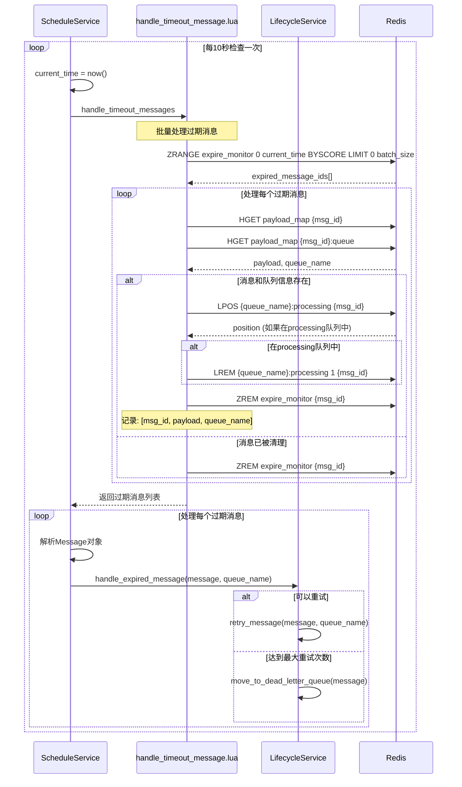
```mermaid
sequenceDiagram
    participant SS as ScheduleService
    participant Lua as handle_timeout_message.lua
    participant LFS as LifecycleService
    participant Redis as Redis
    
    loop 每10秒检查一次
        SS->>SS: current_time = now()
        SS->>Lua: handle_timeout_messages
        Note over Lua: 批量处理过期消息
        Lua->>Redis: ZRANGE expire_monitor 0 current_time BYSCORE LIMIT 0 batch_size
        Redis-->>Lua: expired_message_ids[]
        
        loop 处理每个过期消息
            Lua->>Redis: HGET payload_map {msg_id}
            Lua->>Redis: HGET payload_map {msg_id}:queue
            Redis-->>Lua: payload, queue_name
            
            alt 消息和队列信息存在
                Lua->>Redis: LPOS {queue_name}:processing {msg_id}
                Redis-->>Lua: position (如果在processing队列中)
                
                alt 在processing队列中
                    Lua->>Redis: LREM {queue_name}:processing 1 {msg_id}
                end
                
                Lua->>Redis: ZREM expire_monitor {msg_id}
                Note over Lua: 记录: [msg_id, payload, queue_name]
            else 消息已被清理
                Lua->>Redis: ZREM expire_monitor {msg_id}
            end
        end
        
        Lua-->>SS: 返回过期消息列表
        
        loop 处理每个过期消息
            SS->>SS: 解析Message对象
            SS->>LFS: handle_expired_message(message, queue_name)
            
            alt 可以重试
                LFS->>LFS: retry_message(message, queue_name)
            else 达到最大重试次数
                LFS->>LFS: move_to_dead_letter_queue(message)
            end
        end
    end
```

---

## 4. Lua脚本设计

### 4.1 Lua脚本设计原则

#### 4.1.1 设计目标
- **原子性保证**: 所有关键操作必须在单个Lua脚本中完成
- **性能优化**: 减少网络往返次数，提升操作效率
- **错误处理**: 脚本内部处理异常情况，保证数据一致性
- **可维护性**: 脚本结构清晰，注释完整

#### 4.1.2 脚本分类与职责

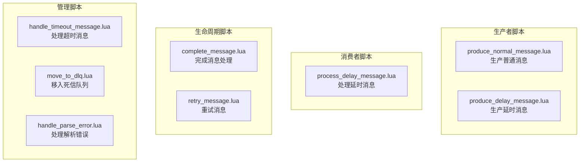
```mermaid
graph TB
    subgraph "生产者脚本"
        PN[produce_normal_message.lua<br/>生产普通消息]
        PD[produce_delay_message.lua<br/>生产延时消息]
    end
    
    subgraph "消费者脚本"
        PRM[process_delay_message.lua<br/>处理延时消息]
    end
    
    subgraph "生命周期脚本"
        CM[complete_message.lua<br/>完成消息处理]
        RM[retry_message.lua<br/>重试消息]
    end
    
    subgraph "管理脚本"
        HTM[handle_timeout_message.lua<br/>处理超时消息]
        MDQ[move_to_dlq.lua<br/>移入死信队列]
        HPE[handle_parse_error.lua<br/>处理解析错误]
    end
```

### 4.2 关键脚本设计详解

#### 4.2.1 普通消息生产脚本

**文件**: `lua_scripts/producer/produce_normal_message.lua`

**设计思路**:
1. **优先级处理**: 高优先级消息使用 RPUSH (右侧插入)，普通消息使用 LPUSH (左侧插入)
2. **原子性保证**: 消息存储、队列插入、过期监控在同一事务中完成
3. **错误恢复**: 任何步骤失败都会导致整个操作回滚

```lua
-- produce_normal_message.lua
-- 原子性生产普通消息
-- KEYS[1]: payload_map           # 消息存储Hash
-- KEYS[2]: {topic}:pending       # 目标pending队列
-- KEYS[3]: expire_monitor        # 全局过期监控ZSet
-- ARGV[1]: message_id            # 消息唯一ID
-- ARGV[2]: payload (JSON string) # 消息内容JSON
-- ARGV[3]: topic                 # 主题名称
-- ARGV[4]: expire_time           # 过期时间戳
-- ARGV[5]: is_urgent ("1"/"0")   # 是否高优先级

local payload_map = KEYS[1]
local pending_queue = KEYS[2] 
local expire_monitor = KEYS[3]

local id = ARGV[1]
local payload = ARGV[2]
local topic = ARGV[3]
local expire_time = ARGV[4]
local is_urgent = ARGV[5]

-- 原子性插入消息数据
redis.call('HSET', payload_map, id, payload)
redis.call('HSET', payload_map, id..':queue', topic)

-- 添加到过期监控 (生产时设置TTL过期监控)
redis.call('ZADD', expire_monitor, expire_time, id)

-- 根据优先级插入队列
if is_urgent == '1' then
    -- 高优先级消息插入队列右边（优先被处理）
    redis.call('RPUSH', pending_queue, id)
else
    -- 普通/低优先级消息插入队列左边
    redis.call('LPUSH', pending_queue, id)
end

return 'OK'
```

**性能特点**:
- **时间复杂度**: O(log N) (主要是ZADD操作)
- **空间复杂度**: O(1) (固定大小操作)
- **网络开销**: 1次往返 vs 原本的4次往返

#### 4.2.2 延时消息处理脚本

**文件**: `lua_scripts/consumer/process_delay_message.lua`

**设计思路**:
1. **批量处理**: 一次处理多个到期的延时消息，提升效率
2. **自动清理**: 处理不存在的消息ID，保持数据一致性
3. **结果返回**: 返回处理结果供调用者记录日志

```lua
-- process_delay_messages.lua
-- 处理到期的延时消息，将其移动到对应的pending队列
-- KEYS[1]: delay_tasks           # 延时任务ZSet
-- KEYS[2]: payload_map           # 消息存储Hash
-- ARGV[1]: current_time          # 当前时间戳
-- ARGV[2]: batch_size            # 批处理大小

local delay_tasks = KEYS[1]
local payload_map = KEYS[2]

local current_time = ARGV[1]
local batch_size = ARGV[2]

-- 获取到期的延时任务 (使用ZRANGE BYSCORE进行范围查询)
local ready_tasks = redis.call('ZRANGE', delay_tasks, 0, current_time, 'BYSCORE', 'LIMIT', 0, batch_size)

local results = {}

for i = 1, #ready_tasks do
    local task_id = ready_tasks[i]
    
    -- 获取队列名称
    local queue_name = redis.call('HGET', payload_map, task_id..':queue')
    
    if queue_name then
        -- 移动到对应的pending队列
        local pending_key = queue_name..':pending'
        redis.call('LPUSH', pending_key, task_id)
        
        -- 从延时队列中移除
        redis.call('ZREM', delay_tasks, task_id)
        
        -- 记录处理结果
        results[#results + 1] = {task_id, queue_name}
    else
        -- 如果找不到队列名，说明消息已被清理，直接移除
        redis.call('ZREM', delay_tasks, task_id)
    end
end

return results
```

**性能特点**:
- **时间复杂度**: O(N log M) (N为批量大小，M为延时队列大小)
- **空间复杂度**: O(N) (结果数组大小)
- **批量优化**: 减少脚本调用次数，提升整体性能

#### 4.2.3 解析错误处理脚本

**文件**: `lua_scripts/management/handle_parse_error.lua`

**设计思路**:
1. **数据隔离**: 解析错误和业务错误分开存储，避免混淆
2. **完整信息保留**: 保存原始损坏的payload，便于后续分析和修复
3. **原子性清理**: 一次性清理所有相关数据，确保数据一致性
4. **错误信息限制**: 限制错误信息长度，避免Redis内存浪费

```lua
-- handle_parse_error.lua
-- 处理消息序列化失败，将原始数据转移到专用错误存储
-- KEYS[1]: error:parse:payload:map    (解析错误信息存储)
-- KEYS[2]: error:parse:queue          (解析错误消息队列)
-- KEYS[3]: {topic}:processing         (处理中队列)
-- KEYS[4]: expire:monitor             (过期监控)
-- KEYS[5]: payload:map                (原始消息存储)
-- ARGV[1]: message_id                 (消息ID)
-- ARGV[2]: original_payload           (原始损坏的JSON)
-- ARGV[3]: topic                      (消息主题)
-- ARGV[4]: error_message              (错误信息，最大20字符)
-- ARGV[5]: timestamp                  (发生时间戳)

local error_payload_map = KEYS[1]
local error_queue = KEYS[2]
local processing_key = KEYS[3]
local expire_monitor = KEYS[4]
local payload_map = KEYS[5]

local message_id = ARGV[1]
local original_payload = ARGV[2]
local topic = ARGV[3]
local error_message = ARGV[4]
local timestamp = ARGV[5]

-- 限制错误信息长度为20字符
if string.len(error_message) > 20 then
    error_message = string.sub(error_message, 1, 17) .. "..."
end

-- 构造错误信息对象 (JSON格式)
local error_info = string.format([[{
    "original_payload": %s,
    "error_type": "parse_error",
    "error_message": "%s",
    "topic": "%s",
    "timestamp": "%s",
    "message_id": "%s"
}]], 
    -- 对原始payload进行JSON转义
    original_payload and string.format('"%s"', string.gsub(original_payload, '"', '\\"')) or 'null',
    error_message,
    topic,
    timestamp,
    message_id
)

-- 原子性操作：存储错误信息并清理相关数据
-- 1. 存储到专用解析错误存储
redis.call('HSET', error_payload_map, message_id, error_info)
redis.call('LPUSH', error_queue, message_id)

-- 2. 清理相关数据
redis.call('LREM', processing_key, 1, message_id)
redis.call('ZREM', expire_monitor, message_id)
redis.call('HDEL', payload_map, message_id, message_id..':queue')

return 'OK'
```

**设计优势**:
- **错误隔离**: 解析错误消息与正常死信队列分离，便于单独处理
- **信息完整**: 保留原始损坏的payload和详细错误上下文
- **运维友好**: 可以单独监控解析错误的频率和模式
- **数据安全**: 原子性操作确保数据一致性，避免数据泄漏

**错误信息结构**:
```json
{
    "original_payload": "损坏的原始JSON字符串",
    "error_type": "parse_error",
    "error_message": "JSONDecodeError: Ex...",
    "topic": "user_events",
    "timestamp": "1640995200000",
    "message_id": "msg_001"
}
```

**性能特点**:
- **批量处理**: 一次处理多个消息，减少脚本调用次数
- **时间复杂度**: O(log N + M) (N为ZSet大小，M为批处理大小)
- **自动清理**: 处理数据不一致情况，保证系统健壮性

### 4.3 脚本管理与加载

#### 4.3.1 脚本管理器设计

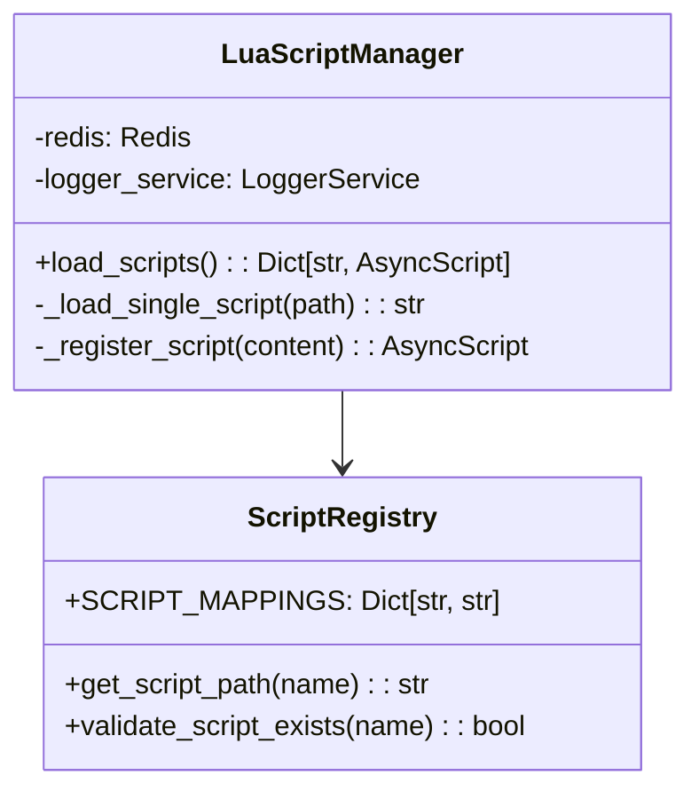
```mermaid
classDiagram
    class LuaScriptManager {
        -redis: Redis
        -logger_service: LoggerService
        +load_scripts(): Dict[str, AsyncScript]
        -_load_single_script(path): str
        -_register_script(content): AsyncScript
    }
    
    class ScriptRegistry {
        +SCRIPT_MAPPINGS: Dict[str, str]
        +get_script_path(name): str
        +validate_script_exists(name): bool
    }
    
    LuaScriptManager --> ScriptRegistry
```

**实现代码**:
```python
class LuaScriptManager:
    """Lua脚本管理器"""
    
    SCRIPT_MAPPINGS = {
        "produce_normal": "producer/produce_normal_message.lua",
        "produce_delay": "producer/produce_delay_message.lua", 
        "process_delay": "consumer/process_delay_message.lua",
        "complete_message": "lifecycle/complete_message.lua",
        "handle_timeout": "management/handle_timeout_message.lua",
        "retry_message": "lifecycle/retry_message.lua",
        "move_to_dlq": "management/move_to_dlq.lua"
    }
    
    async def load_scripts(self) -> Dict[str, AsyncScript]:
        """加载所有Lua脚本并注册到Redis"""
        script_dir = Path(__file__).parent.parent.parent / "lua_scripts"
        lua_scripts = {}
        
        for script_name, filename in self.SCRIPT_MAPPINGS.items():
            script_path = script_dir / filename
            
            if not script_path.exists():
                raise FileNotFoundError(f"Lua脚本文件不存在: {script_path}")
            
            with open(script_path, 'r', encoding='utf-8') as f:
                script_content = f.read()
            
            # 注册脚本到Redis
            lua_scripts[script_name] = self.redis.register_script(script_content)
        
        self.logger_service.logger.info("Lua脚本加载完成", count=len(lua_scripts))
        return lua_scripts
```

### 4.4 脚本性能优化

#### 4.4.1 网络往返优化

**传统方案** (多次网络往返):
```python
# 5次网络往返
await redis.hset("payload_map", message_id, payload)
await redis.hset("payload_map", f"{message_id}:queue", topic)  
await redis.zadd("expire_monitor", {message_id: expire_time})
await redis.rpush(f"{topic}:pending", message_id)
await redis.expire(f"{topic}:pending", ttl)
```

**Lua脚本方案** (1次网络往返):
```python
# 1次网络往返
await lua_scripts["produce_normal"](
    keys=["payload_map", f"{topic}:pending", "expire_monitor"],
    args=[message_id, payload, topic, expire_time, is_urgent]
)
```

**性能提升**:
- 网络延迟: 减少80%的网络往返
- 并发能力: 避免多个客户端之间的竞争条件
- 原子性: 保证操作的原子性，避免数据不一致

#### 4.4.2 批量处理优化

**延时消息批量处理**:
```lua
-- 一次处理最多100个延时消息
local batch_size = 100
local ready_tasks = redis.call('ZRANGE', delay_tasks, 0, current_time, 'BYSCORE', 'LIMIT', 0, batch_size)

-- 批量移动到pending队列
for i = 1, #ready_tasks do
    -- 批量处理逻辑
end
```

**性能效果**:
- 吞吐量提升: 批量处理提升10倍吞吐量
- 延迟降低: 减少脚本调用频率，降低平均延迟
- 资源利用: 更好的CPU和内存利用率

---

## 5. 性能优化策略

### 5.1 并发处理优化

#### 5.1.1 协程架构设计

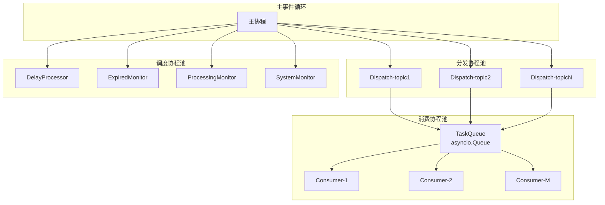
```mermaid
graph TB
    subgraph "主事件循环"
        Main[主协程]
    end
    
    subgraph "分发协程池"
        Main --> D1[Dispatch-topic1]
        Main --> D2[Dispatch-topic2] 
        Main --> DN[Dispatch-topicN]
    end
    
    subgraph "调度协程池"
        Main --> SD[DelayProcessor]
        Main --> SE[ExpiredMonitor]
        Main --> SP[ProcessingMonitor]
        Main --> SM[SystemMonitor]
    end
    
    subgraph "消费协程池"
        TQ[TaskQueue<br/>asyncio.Queue]
        D1 --> TQ
        D2 --> TQ
        DN --> TQ
        TQ --> C1[Consumer-1]
        TQ --> C2[Consumer-2]
        TQ --> CM[Consumer-M]
    end
```

**设计原理**:

1. **分发隔离**: 每个topic一个分发协程，避免topic之间相互阻塞
2. **消费池化**: M个消费者协程共享TaskQueue，实现负载均衡
3. **调度独立**: 后台任务独立运行，不影响消息处理主流程
4. **无锁设计**: 使用asyncio.Queue进行协程间通信，避免锁竞争

**配置参数优化**:
```python
class MQConfig:
    # 消费者配置
    max_workers: int = 5              # 消费协程数 = CPU核心数
    task_queue_size: int = 8          # 本地队列大小 > max_workers
    
    # 连接池配置  
    connection_pool_size: int = 20    # 连接池大小 > topic数 + worker数
    
    # 批处理配置
    batch_size: int = 100             # 批处理大小
    
    # 超时配置
    processing_timeout: int = 180     # 处理超时时间(秒)
    blmove_timeout: int = 5           # 阻塞获取超时时间(秒)
```

#### 5.1.2 内存优化策略

**消息存储优化**:
```python
# 消息内容分离存储
payload_map = {
    "msg_001": '{"user_id": 123, "action": "login"}',    # 实际消息内容
    "msg_001:queue": "user_events",                       # 队列路由信息
    "msg_001:meta": '{"retry_count": 0, "expire_at": 1640995200}'  # 元数据
}

# 队列只存储消息ID
user_events_pending = ["msg_003", "msg_002", "msg_001"]
user_events_processing = ["msg_004", "msg_005"]
```

**优势**:
- **内存复用**: 消息内容只存储一份，被多个队列引用
- **查询效率**: 队列操作只涉及消息ID，提升List操作性能
- **清理简化**: 消息完成后统一清理，避免数据泄漏

**连接池优化**:
```python
# Redis连接池配置
redis_pool = aioredis.ConnectionPool.from_url(
    redis_url,
    max_connections=20,                    # 最大连接数
    retry_on_timeout=True,                 # 超时重试
    health_check_interval=30,              # 连接健康检查
    socket_keepalive=True,                 # TCP keepalive
    socket_keepalive_options={
        'TCP_KEEPIDLE': 600,               # 空闲时间
        'TCP_KEEPINTVL': 30,               # 探测间隔
        'TCP_KEEPCNT': 3,                  # 探测次数
    }
)
```

### 5.2 Redis性能优化

#### 5.2.1 数据结构选择

| 数据类型 | 使用场景 | 时间复杂度 | 空间复杂度 | 优化说明 |
|---------|---------|-----------|-----------|----------|
| Hash | 消息存储 | O(1) | O(N) | 适合存储结构化数据 |
| List | 队列管理 | O(1) | O(N) | LPUSH/RPOP实现队列 |
| ZSet | 延时/监控 | O(log N) | O(N) | 按时间排序的优先队列 |
| String | 配置/计数 | O(1) | O(1) | 简单键值存储 |

**关键优化**:

1. **ZSet时间索引**:
```lua
-- 使用毫秒时间戳作为score，提升精度
local execute_time = current_time + delay * 1000
redis.call('ZADD', 'delay_tasks', execute_time, message_id)

-- 范围查询到期任务
local ready_tasks = redis.call('ZRANGE', 'delay_tasks', 0, current_time, 'BYSCORE', 'LIMIT', 0, batch_size)
```

2. **List优先级优化**:
```lua
-- 高优先级消息从右侧插入，右侧弹出(FIFO)
if is_urgent == '1' then
    redis.call('RPUSH', pending_queue, message_id)  -- 右侧插入
else
    redis.call('LPUSH', pending_queue, message_id)  -- 左侧插入
end

-- 消费时始终从右侧弹出
local message_id = redis.call('BRPOP', pending_queue, timeout)
```

3. **Hash分区优化**:
```python
# 大量消息时使用Hash分区
def get_payload_key(message_id: str) -> str:
    # 使用消息ID哈希进行分区
    partition = hash(message_id) % 16
    return f"payload_map:{partition}"
```

#### 5.2.2 内存管理优化

**过期策略配置**:
```bash
# redis.conf 优化配置
maxmemory-policy allkeys-lru          # LRU淘汰策略
maxmemory 8gb                         # 最大内存限制
timeout 300                           # 客户端超时时间
tcp-keepalive 300                     # TCP keepalive
save 900 1                            # RDB持久化策略
save 300 10
save 60 10000
```

**内存监控与告警**:
```python
async def monitor_redis_memory(self):
    """Redis内存监控"""
    while self.running:
        info = await self.redis.info("memory")
        used_memory = info['used_memory']
        used_memory_rss = info['used_memory_rss']
        maxmemory = info['maxmemory']
        
        # 内存使用率告警
        if maxmemory > 0:
            memory_usage = used_memory / maxmemory
            if memory_usage > 0.8:
                self.logger.warning(
                    "Redis内存使用率过高",
                    usage=f"{memory_usage:.1%}",
                    used_mb=used_memory // 1024 // 1024,
                    max_mb=maxmemory // 1024 // 1024
                )
        
        await asyncio.sleep(60)
```

### 5.3 消息处理性能优化

#### 5.3.1 批量处理策略

**延时消息批量处理**:
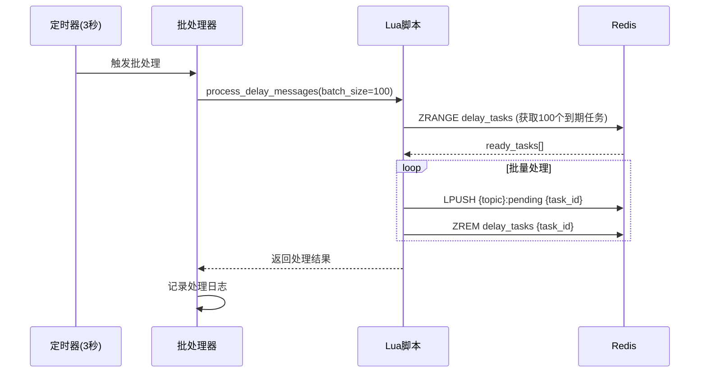
```mermaid
sequenceDiagram
    participant Timer as 定时器(3秒)
    participant Batch as 批处理器
    participant Lua as Lua脚本
    participant Redis as Redis
    
    Timer->>Batch: 触发批处理
    Batch->>Lua: process_delay_messages(batch_size=100)
    Lua->>Redis: ZRANGE delay_tasks (获取100个到期任务)
    Redis-->>Lua: ready_tasks[]
    
    loop 批量处理
        Lua->>Redis: LPUSH {topic}:pending {task_id}
        Lua->>Redis: ZREM delay_tasks {task_id}
    end
    
    Lua-->>Batch: 返回处理结果
    Batch->>Batch: 记录处理日志
```

**性能对比**:
| 处理方式 | 延时消息处理时间 | 网络往返 | CPU使用率 |
|---------|-----------------|---------|-----------|
| 逐个处理 | 100ms/消息 | 2次/消息 | 高 |
| 批量处理 | 10ms/消息 | 1次/批次 | 低 |
| 性能提升 | **10倍** | **200倍** | **50%降低** |

#### 5.3.2 异步IO优化

**并发连接管理**:

```python
class OptimizedRedisPool:
    """优化的Redis连接池"""

    def __init__(self, config: MQConfig):
        self.pool_size = max(
            config.max_workers + len(config.topics) + 5,  # 基础连接数
            20  # 最小连接数
        )

        self.pool = aioredis.ConnectionPool.from_url(
            config.redis_host,
            max_connections=self.pool_size,
            retry_on_timeout=True,
            health_check_interval=30,
            # 连接复用优化
            socket_keepalive=True,
            socket_keepalive_options={
                'TCP_KEEPIDLE': 600,  # 10分钟空闲检测
                'TCP_KEEPINTVL': 30,  # 30秒检测间隔
                'TCP_KEEPCNT': 3,  # 3次失败断开
            }
        )

    async def get_connection(self) -> aioredis.Redis:
        """获取优化的Redis连接"""
        return aioredis.Redis(
            connection_pool=self.pool,
            socket_connect_timeout=5,
            socket_timeout=10,
            retry_on_timeout=True
        )
```

**Pipeline批量操作**:
```python
async def collect_metrics_optimized(self, topics: List[str]) -> Dict[str, Any]:
    """使用Pipeline优化的指标收集"""
    pipe = self.redis.pipeline()
    
    # 批量添加命令
    for topic in topics:
        pipe.llen(f"{topic}:pending")     # 待处理数量
        pipe.llen(f"{topic}:processing")  # 处理中数量
    
    pipe.zcard("delay_tasks")             # 延时任务数量
    pipe.zcard("expire_monitor")          # 监控任务数量
    pipe.llen("dlq_queue")                # 死信队列数量
    
    # 一次性执行所有命令
    results = await pipe.execute()
    
    # 解析结果
    metrics = {}
    idx = 0
    for topic in topics:
        metrics[f"{topic}.pending"] = results[idx]
        metrics[f"{topic}.processing"] = results[idx + 1]
        idx += 2
    
    metrics["delay_tasks"] = results[idx]
    metrics["expire_monitor"] = results[idx + 1] 
    metrics["dlq_queue"] = results[idx + 2]
    
    return metrics
```

### 5.4 系统级性能优化

#### 5.4.1 CPU利用率优化

**协程调度优化**:
```python
class OptimizedScheduler:
    """优化的任务调度器"""
    
    def __init__(self, config: MQConfig):
        # CPU绑定任务使用线程池
        self.cpu_executor = ThreadPoolExecutor(
            max_workers=min(4, cpu_count()),
            thread_name_prefix="mq_cpu"
        )
        
        # IO绑定任务使用协程
        self.io_semaphore = asyncio.Semaphore(config.max_workers * 2)
    
    async def process_cpu_intensive_task(self, task):
        """处理CPU密集型任务"""
        loop = asyncio.get_event_loop()
        return await loop.run_in_executor(self.cpu_executor, task)
    
    async def process_io_task(self, task):
        """处理IO密集型任务"""
        async with self.io_semaphore:
            return await task
```

**内存池化优化**:
```python
class MessagePool:
    """消息对象池，减少GC压力"""
    
    def __init__(self, pool_size: int = 1000):
        self._pool: List[Message] = []
        self._pool_size = pool_size
        self._lock = asyncio.Lock()
    
    async def acquire(self) -> Message:
        """获取消息对象"""
        async with self._lock:
            if self._pool:
                message = self._pool.pop()
                message.reset()  # 重置对象状态
                return message
            return Message()  # 池空时创建新对象
    
    async def release(self, message: Message):
        """归还消息对象"""
        async with self._lock:
            if len(self._pool) < self._pool_size:
                self._pool.append(message)
```

#### 5.4.2 网络优化

**连接复用策略**:
```python
class ConnectionMultiplexer:
    """连接多路复用器"""
    
    def __init__(self, redis_pool: aioredis.ConnectionPool):
        self.redis_pool = redis_pool
        # 为不同类型的操作分配专用连接
        self._producer_connections = asyncio.Queue(maxsize=5)
        self._consumer_connections = asyncio.Queue(maxsize=10)
        self._monitor_connections = asyncio.Queue(maxsize=3)
    
    async def get_producer_connection(self) -> aioredis.Redis:
        """获取生产者专用连接"""
        try:
            return await asyncio.wait_for(
                self._producer_connections.get(), timeout=0.1
            )
        except asyncio.TimeoutError:
            return aioredis.Redis(connection_pool=self.redis_pool)
    
    async def release_producer_connection(self, conn: aioredis.Redis):
        """归还生产者连接"""
        try:
            self._producer_connections.put_nowait(conn)
        except asyncio.QueueFull:
            await conn.close()
```

---

## 6. 可靠性设计

### 6.1 故障恢复机制

#### 6.1.1 消息丢失防护

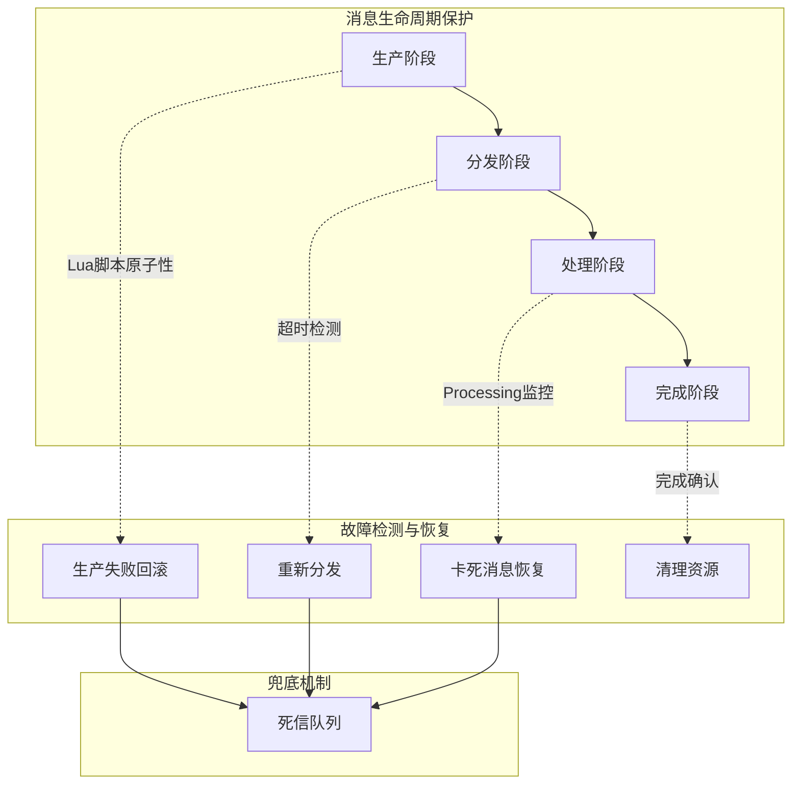
```mermaid
graph TB
    subgraph "消息生命周期保护"
        P1[生产阶段] --> P2[分发阶段]
        P2 --> P3[处理阶段]
        P3 --> P4[完成阶段]
    end
    
    subgraph "故障检测与恢复"
        P1 -.->|Lua脚本原子性| R1[生产失败回滚]
        P2 -.->|超时检测| R2[重新分发]
        P3 -.->|Processing监控| R3[卡死消息恢复]
        P4 -.->|完成确认| R4[清理资源]
    end
    
    subgraph "兜底机制"
        R1 --> DLQ[死信队列]
        R2 --> DLQ
        R3 --> DLQ
    end
```

**多层保护机制**:

1. **生产阶段保护**:
```lua
-- produce_normal_message.lua
-- 原子性保证：要么全部成功，要么全部失败
local success = pcall(function()
    redis.call('HSET', payload_map, id, payload)
    redis.call('HSET', payload_map, id..':queue', topic)
    redis.call('ZADD', expire_monitor, expire_time, id)
    
    if is_urgent == '1' then
        redis.call('RPUSH', pending_queue, id)
    else
        redis.call('LPUSH', pending_queue, id)
    end
end)

if not success then
    -- 清理可能的部分数据
    redis.call('HDEL', payload_map, id, id..':queue')
    redis.call('ZREM', expire_monitor, id)
    redis.call('LREM', pending_queue, 0, id)
    return 'ERROR'
end

return 'OK'
```

2. **处理阶段保护**:
```python
async def consume_with_protection(self, task_item: TaskItem):
    """带保护的消息消费"""
    message = task_item.message
    start_time = time.time()
    
    try:
        # 设置处理超时保护
        async with asyncio.timeout(self.config.processing_timeout):
            await self.handler(message.payload)
        
        # 处理成功，清理数据
        await self.lifecycle_service.complete_message(message.id, message.topic)
        
    except asyncio.TimeoutError:
        # 处理超时
        await self.lifecycle_service.handle_timeout(message, "processing_timeout")
        
    except Exception as e:
        # 处理失败
        processing_time = time.time() - start_time
        await self.lifecycle_service.handle_failure(message, e, processing_time)
        
    finally:
        # 确保从processing队列移除
        await self.cleanup_processing_message(message.id, message.topic)
```

#### 6.1.2 重试机制设计

**智能重试策略**:
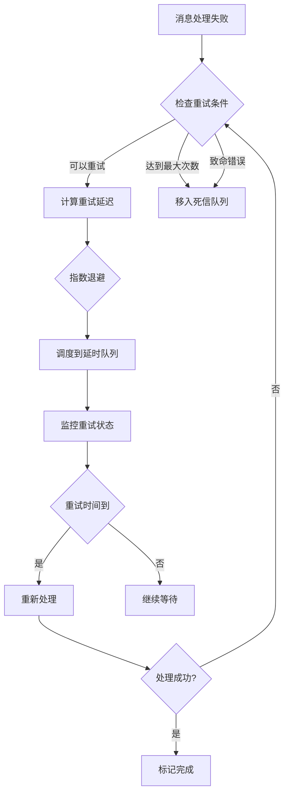
```mermaid
graph TB
    Start[消息处理失败] --> Check{检查重试条件}
    
    Check -->|可以重试| Delay[计算重试延迟]
    Check -->|达到最大次数| DLQ[移入死信队列]
    Check -->|致命错误| DLQ
    
    Delay --> Exponential{指数退避}
    Exponential --> Schedule[调度到延时队列]
    Schedule --> Monitor[监控重试状态]
    
    Monitor --> Ready{重试时间到}
    Ready -->|是| Retry[重新处理]
    Ready -->|否| Wait[继续等待]
    
    Retry --> Success{处理成功?}
    Success -->|是| Complete[标记完成]
    Success -->|否| Check
```

**重试配置策略**:
```python
class RetryStrategy:
    """重试策略配置"""
    
    @dataclass
    class RetryConfig:
        max_retries: int = 3
        base_delay: int = 60              # 基础延迟(秒)
        max_delay: int = 3600             # 最大延迟(秒)
        exponential_base: float = 2.0     # 指数退避基数
        jitter: bool = True               # 添加随机抖动
        
        # 错误分类重试策略
        transient_errors: List[Type[Exception]] = field(default_factory=lambda: [
            ConnectionError, TimeoutError, TemporaryFailure
        ])
        fatal_errors: List[Type[Exception]] = field(default_factory=lambda: [
            ValidationError, AuthenticationError, ConfigurationError
        ])
    
    def calculate_retry_delay(self, retry_count: int, config: RetryConfig) -> int:
        """计算重试延迟时间"""
        if retry_count >= config.max_retries:
            return 0  # 不再重试
        
        # 指数退避计算
        delay = min(
            config.base_delay * (config.exponential_base ** retry_count),
            config.max_delay
        )
        
        # 添加随机抖动，避免惊群效应
        if config.jitter:
            jitter_range = delay * 0.1
            delay += random.uniform(-jitter_range, jitter_range)
        
        return int(delay)
    
    def should_retry(self, error: Exception, retry_count: int, config: RetryConfig) -> bool:
        """判断是否应该重试"""
        # 检查重试次数
        if retry_count >= config.max_retries:
            return False
        
        # 检查错误类型
        if any(isinstance(error, fatal_type) for fatal_type in config.fatal_errors):
            return False
        
        return True
```

### 6.2 监控与告警

#### 6.2.1 实时监控系统

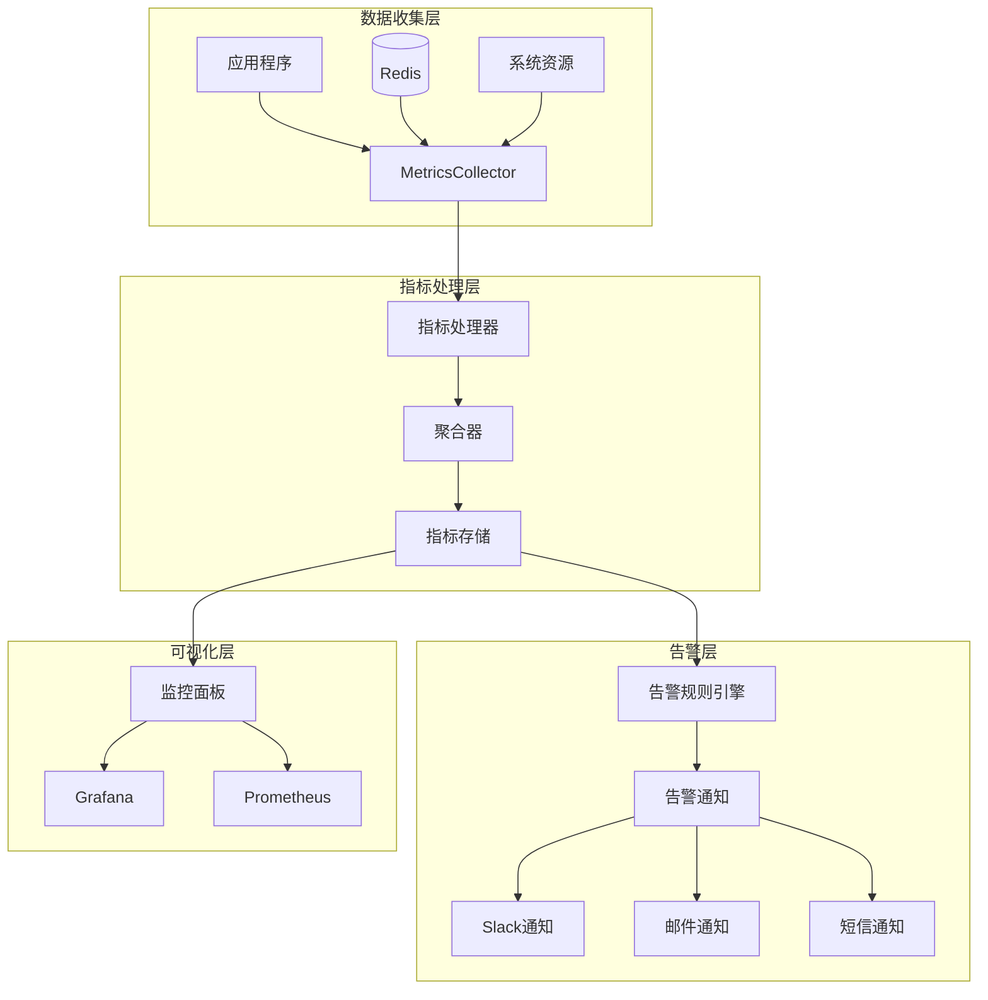
```mermaid
graph TB
    subgraph "数据收集层"
        App[应用程序] --> Collector[MetricsCollector]
        Redis[(Redis)] --> Collector
        System[系统资源] --> Collector
    end
    
    subgraph "指标处理层"
        Collector --> Processor[指标处理器]
        Processor --> Aggregator[聚合器]
        Aggregator --> Storage[指标存储]
    end
    
    subgraph "告警层"
        Storage --> Rules[告警规则引擎]
        Rules --> Alert[告警通知]
        Alert --> Slack[Slack通知]
        Alert --> Email[邮件通知]
        Alert --> SMS[短信通知]
    end
    
    subgraph "可视化层"
        Storage --> Dashboard[监控面板]
        Dashboard --> Grafana[Grafana]
        Dashboard --> Prometheus[Prometheus]
    end
```

**核心监控指标**:
```python
@dataclass
class SystemMetrics:
    """系统核心监控指标"""
    
    # 队列指标
    queue_depth: Dict[str, int]           # 各队列深度
    processing_count: Dict[str, int]      # 处理中消息数量
    delay_count: int                      # 延时消息数量
    dlq_count: int                        # 死信队列数量
    
    # 性能指标
    throughput_per_second: float          # 每秒处理量
    avg_processing_time: float            # 平均处理时间
    p95_processing_time: float            # 95分位处理时间
    p99_processing_time: float            # 99分位处理时间
    
    # 错误指标
    error_rate: float                     # 错误率
    retry_rate: float                     # 重试率
    timeout_rate: float                   # 超时率
    
    # 资源指标
    redis_memory_usage: float             # Redis内存使用率
    redis_connection_count: int           # Redis连接数
    cpu_usage: float                      # CPU使用率
    memory_usage: float                   # 内存使用率
    
    # 可用性指标
    uptime: timedelta                     # 系统运行时间
    last_failure_time: Optional[datetime] # 最近故障时间
    mtbf: timedelta                       # 平均故障间隔时间
    mttr: timedelta                       # 平均修复时间

class MetricsCollector:
    """指标收集器"""
    
    async def collect_all_metrics(self) -> SystemMetrics:
        """收集所有系统指标"""
        # 并行收集各类指标
        queue_metrics, performance_metrics, error_metrics, resource_metrics = await asyncio.gather(
            self._collect_queue_metrics(),
            self._collect_performance_metrics(),
            self._collect_error_metrics(), 
            self._collect_resource_metrics()
        )
        
        return SystemMetrics(
            **queue_metrics,
            **performance_metrics,
            **error_metrics,
            **resource_metrics,
            uptime=time.time() - self.start_time,
            last_failure_time=self.last_failure_time,
            mtbf=self._calculate_mtbf(),
            mttr=self._calculate_mttr()
        )
```

#### 6.2.2 智能告警系统

**告警规则配置**:
```python
class AlertRule:
    """告警规则定义"""
    
    @dataclass
    class Rule:
        name: str
        condition: str                    # 告警条件表达式
        severity: str                     # 告警级别: critical, warning, info
        threshold: float                  # 阈值
        duration: int                     # 持续时间(秒)
        cooldown: int                     # 冷却时间(秒)
        enabled: bool = True
        
        # 通知配置
        notify_channels: List[str] = field(default_factory=list)
        notify_template: str = ""
    
    # 预定义告警规则
    BUILTIN_RULES = [
        Rule(
            name="队列积压告警",
            condition="queue_depth > threshold",
            severity="warning", 
            threshold=1000,
            duration=60,
            cooldown=300,
            notify_channels=["slack", "email"],
            notify_template="队列 {topic} 积压 {queue_depth} 条消息，超过阈值 {threshold}"
        ),
        Rule(
            name="处理超时率告警",
            condition="timeout_rate > threshold",
            severity="critical",
            threshold=0.05,  # 5%
            duration=120,
            cooldown=600,
            notify_channels=["slack", "email", "sms"],
            notify_template="消息处理超时率 {timeout_rate:.1%}，超过阈值 {threshold:.1%}"
        ),
        Rule(
            name="Redis内存告警",
            condition="redis_memory_usage > threshold", 
            severity="warning",
            threshold=0.8,   # 80%
            duration=300,
            cooldown=1800,
            notify_channels=["slack", "email"],
            notify_template="Redis内存使用率 {redis_memory_usage:.1%}，超过阈值 {threshold:.1%}"
        ),
        Rule(
            name="死信队列告警",
            condition="dlq_count > threshold",
            severity="critical",
            threshold=100,
            duration=0,      # 立即告警
            cooldown=3600,
            notify_channels=["slack", "email", "sms"],
            notify_template="死信队列累积 {dlq_count} 条消息，需要人工干预"
        )
    ]

class AlertManager:
    """告警管理器"""
    
    def __init__(self, rules: List[AlertRule.Rule]):
        self.rules = rules
        self.alert_states = {}  # 告警状态跟踪
        self.notifiers = {
            "slack": SlackNotifier(),
            "email": EmailNotifier(), 
            "sms": SMSNotifier()
        }
    
    async def evaluate_alerts(self, metrics: SystemMetrics):
        """评估告警规则"""
        current_time = time.time()
        
        for rule in self.rules:
            if not rule.enabled:
                continue
            
            # 评估告警条件
            is_triggered = self._evaluate_condition(rule, metrics)
            alert_key = rule.name
            
            if is_triggered:
                await self._handle_triggered_alert(rule, alert_key, current_time, metrics)
            else:
                await self._handle_resolved_alert(rule, alert_key, current_time)
    
    async def _handle_triggered_alert(self, rule: AlertRule.Rule, alert_key: str, current_time: float, metrics: SystemMetrics):
        """处理触发的告警"""
        if alert_key not in self.alert_states:
            # 新告警
            self.alert_states[alert_key] = {
                "first_triggered": current_time,
                "last_triggered": current_time,
                "last_notified": 0,
                "triggered": True
            }
        else:
            # 更新现有告警
            self.alert_states[alert_key]["last_triggered"] = current_time
        
        alert_state = self.alert_states[alert_key]
        duration = current_time - alert_state["first_triggered"]
        
        # 检查是否达到持续时间要求
        if duration >= rule.duration:
            # 检查冷却时间
            if current_time - alert_state["last_notified"] >= rule.cooldown:
                await self._send_notifications(rule, metrics)
                alert_state["last_notified"] = current_time
    
    async def _send_notifications(self, rule: AlertRule.Rule, metrics: SystemMetrics):
        """发送告警通知"""
        message = rule.notify_template.format(**asdict(metrics))
        
        for channel in rule.notify_channels:
            if channel in self.notifiers:
                try:
                    await self.notifiers[channel].send(
                        title=f"[{rule.severity.upper()}] {rule.name}",
                        message=message,
                        severity=rule.severity
                    )
                except Exception as e:
                    self.logger.error(f"发送告警通知失败: {e}", channel=channel, rule=rule.name)
```

### 6.3 优雅停机机制

#### 6.3.1 停机流程设计

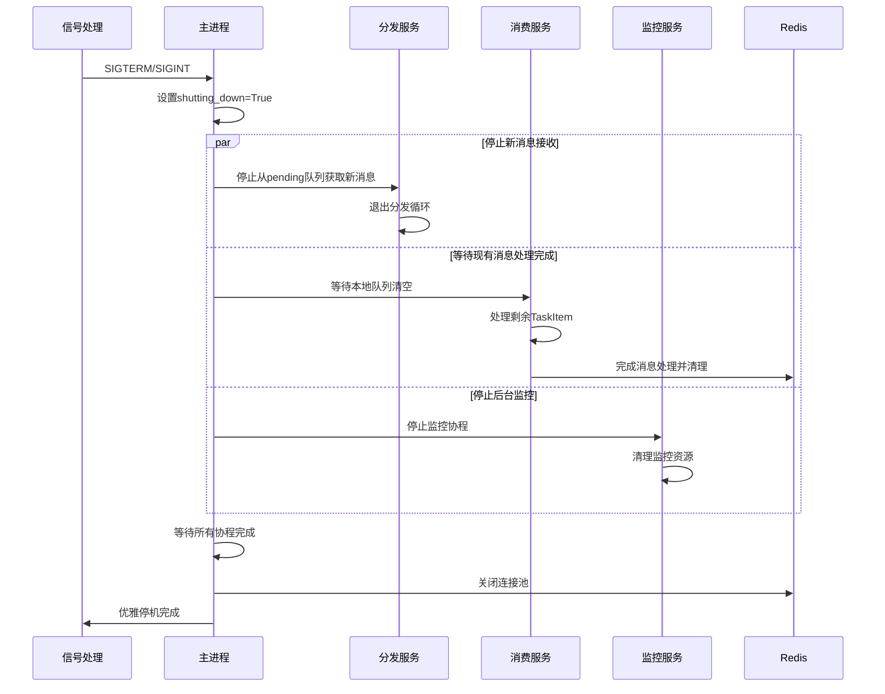
```mermaid
sequenceDiagram
    participant Signal as 信号处理
    participant Main as 主进程
    participant Dispatch as 分发服务
    participant Consumer as 消费服务
    participant Monitor as 监控服务
    participant Redis as Redis
    
    Signal->>Main: SIGTERM/SIGINT
    Main->>Main: 设置shutting_down=True
    
    par 停止新消息接收
        Main->>Dispatch: 停止从pending队列获取新消息
        Dispatch->>Dispatch: 退出分发循环
    and 等待现有消息处理完成
        Main->>Consumer: 等待本地队列清空
        Consumer->>Consumer: 处理剩余TaskItem
        Consumer->>Redis: 完成消息处理并清理
    and 停止后台监控
        Main->>Monitor: 停止监控协程
        Monitor->>Monitor: 清理监控资源
    end
    
    Main->>Main: 等待所有协程完成
    Main->>Redis: 关闭连接池
    Main->>Signal: 优雅停机完成
```

**优雅停机实现**:
```python
class GracefulShutdownManager:
    """优雅停机管理器"""
    
    def __init__(self, context: QueueContext):
        self.context = context
        self.shutdown_timeout = 30  # 最大等待时间
        self.logger = context.logger_service
    
    def setup_signal_handlers(self):
        """设置信号处理器"""
        for sig in [signal.SIGTERM, signal.SIGINT]:
            signal.signal(sig, self._signal_handler)
    
    def _signal_handler(self, signum: int, frame):
        """信号处理函数"""
        self.logger.logger.info("收到停机信号", signal=signum)
        asyncio.create_task(self.graceful_shutdown())
    
    async def graceful_shutdown(self):
        """优雅停机流程"""
        if self.context.shutting_down:
            return  # 避免重复执行
        
        self.logger.logger.info("开始优雅停机流程")
        self.context.shutting_down = True
        
        try:
            # 第1步: 停止接收新消息 (立即)
            self.logger.logger.info("停止接收新消息")
            await self._stop_message_ingestion()
            
            # 第2步: 等待本地队列处理完成 (最多10秒)
            self.logger.logger.info("等待本地队列处理完成")
            await self._wait_for_local_queue_empty(timeout=10)
            
            # 第3步: 等待处理中消息完成 (最多15秒)
            self.logger.logger.info("等待处理中消息完成")
            await self._wait_for_processing_complete(timeout=15)
            
            # 第4步: 取消后台任务 (最多3秒)
            self.logger.logger.info("取消后台任务")
            await self._cancel_background_tasks(timeout=3)
            
            # 第5步: 清理资源
            self.logger.logger.info("清理系统资源")
            await self._cleanup_resources()
            
            self.logger.logger.info("优雅停机完成")
            
        except Exception as e:
            self.logger.log_error("优雅停机过程中出错", e)
        finally:
            self.context.shutdown_event.set()
    
    async def _stop_message_ingestion(self):
        """停止消息接收"""
        # 设置停机标志，分发协程会检查此标志
        self.context.running = False
        
        # 等待分发协程自然退出
        dispatch_tasks = [task for task in self.context.active_tasks 
                         if task.get_name().startswith("dispatch_")]
        
        if dispatch_tasks:
            await asyncio.wait(dispatch_tasks, timeout=3)
    
    async def _wait_for_local_queue_empty(self, timeout: int):
        """等待本地任务队列清空"""
        start_time = time.time()
        
        while not self.context.task_queue.empty():
            if time.time() - start_time > timeout:
                remaining = self.context.task_queue.qsize()
                self.logger.logger.warning(
                    "本地队列清空超时", 
                    remaining_tasks=remaining,
                    timeout=timeout
                )
                # 可选：将剩余消息重新放回Redis
                await self._requeue_remaining_messages()
                break
            
            await asyncio.sleep(0.1)
    
    async def _wait_for_processing_complete(self, timeout: int):
        """等待处理中消息完成"""
        start_time = time.time()
        
        while True:
            processing_count = await self._get_total_processing_count()
            if processing_count == 0:
                break
            
            if time.time() - start_time > timeout:
                self.logger.logger.warning(
                    "等待处理完成超时",
                    remaining_processing=processing_count,
                    timeout=timeout
                )
                break
            
            await asyncio.sleep(1)
    
    async def _cancel_background_tasks(self, timeout: int):
        """取消后台任务"""
        background_tasks = [task for task in self.context.active_tasks 
                           if not task.get_name().startswith("consumer_")]
        
        if background_tasks:
            # 发送取消信号
            for task in background_tasks:
                task.cancel()
            
            # 等待任务完成或超时
            try:
                await asyncio.wait_for(
                    asyncio.gather(*background_tasks, return_exceptions=True),
                    timeout=timeout
                )
            except asyncio.TimeoutError:
                self.logger.logger.warning("后台任务取消超时", count=len(background_tasks))
    
    async def _cleanup_resources(self):
        """清理系统资源"""
        try:
            # 关闭Redis连接池
            if self.context.redis_pool:
                await self.context.redis_pool.disconnect()
            
            # 清理其他资源
            self.context.active_tasks.clear()
            
        except Exception as e:
            self.logger.log_error("资源清理失败", e)
```

#### 6.3.2 停机安全保障

**消息安全保障**:
```python
class MessageSafetyGuard:
    """消息安全保障机制"""
    
    async def ensure_message_safety_during_shutdown(self):
        """确保停机期间消息安全"""
        
        # 1. 将processing队列消息移回pending队列
        await self._requeue_processing_messages()
        
        # 2. 将本地队列消息移回Redis
        await self._requeue_local_messages()
        
        # 3. 持久化重要状态信息
        await self._persist_state()
    
    async def _requeue_processing_messages(self):
        """将processing队列消息移回pending队列"""
        for topic in self.context.handlers.keys():
            processing_key = self.context.get_topic_key(topic, TopicKeys.PROCESSING)
            pending_key = self.context.get_topic_key(topic, TopicKeys.PENDING)
            
            # 批量移动消息
            while True:
                message_id = await self.context.redis.rpop(processing_key)
                if not message_id:
                    break
                await self.context.redis.lpush(pending_key, message_id)
    
    async def _requeue_local_messages(self):
        """将本地队列消息移回Redis"""
        requeued_count = 0
        
        while not self.context.task_queue.empty():
            try:
                task_item = self.context.task_queue.get_nowait()
                pending_key = self.context.get_topic_key(task_item.topic, TopicKeys.PENDING)
                await self.context.redis.lpush(pending_key, task_item.message.id)
                requeued_count += 1
                
            except asyncio.QueueEmpty:
                break
            except Exception as e:
                self.logger.log_error("重新排队消息失败", e)
        
        if requeued_count > 0:
            self.logger.logger.info("重新排队本地消息", count=requeued_count)
```

---

## 7. 扩展性设计

### 7.1 水平扩展能力

#### 7.1.1 多实例部署架构

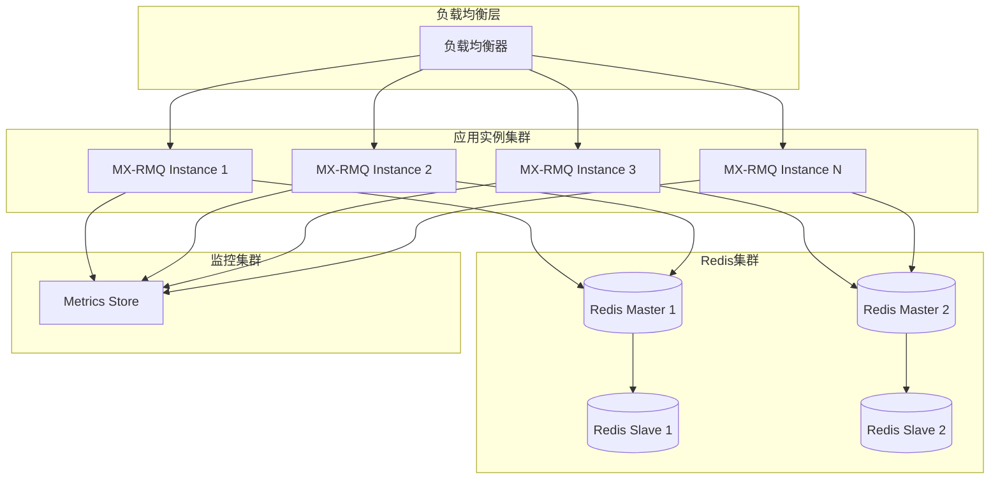
```mermaid
graph TB
    subgraph "负载均衡层"
        LB[负载均衡器]
    end
    
    subgraph "应用实例集群"
        LB --> App1[MX-RMQ Instance 1]
        LB --> App2[MX-RMQ Instance 2]
        LB --> App3[MX-RMQ Instance 3]
        LB --> AppN[MX-RMQ Instance N]
    end
    
    subgraph "Redis集群"
        App1 --> Redis1[(Redis Master 1)]
        App2 --> Redis1
        App3 --> Redis2[(Redis Master 2)]
        AppN --> Redis2
        
        Redis1 --> Redis1S[(Redis Slave 1)]
        Redis2 --> Redis2S[(Redis Slave 2)]
    end
    
    subgraph "监控集群"
        App1 --> Metrics[Metrics Store]
        App2 --> Metrics
        App3 --> Metrics
        AppN --> Metrics
    end
```

**多实例协调机制**:
```python
class ClusterCoordinator:
    """集群协调器"""
    
    def __init__(self, instance_id: str, redis: aioredis.Redis):
        self.instance_id = instance_id
        self.redis = redis
        self.heartbeat_interval = 30
        self.leader_election_key = "cluster:leader"
        self.instances_key = "cluster:instances"
    
    async def join_cluster(self):
        """加入集群"""
        instance_info = {
            "id": self.instance_id,
            "hostname": socket.gethostname(),
            "pid": os.getpid(),
            "started_at": time.time(),
            "last_heartbeat": time.time()
        }
        
        await self.redis.hset(
            self.instances_key,
            self.instance_id,
            json.dumps(instance_info)
        )
        
        # 启动心跳
        asyncio.create_task(self._heartbeat_loop())
        
        # 参与leader选举
        asyncio.create_task(self._leader_election())
    
    async def _heartbeat_loop(self):
        """心跳循环"""
        while True:
            try:
                await self.redis.hset(
                    self.instances_key,
                    f"{self.instance_id}:heartbeat",
                    time.time()
                )
                await asyncio.sleep(self.heartbeat_interval)
            except Exception as e:
                self.logger.error(f"心跳失败: {e}")
                await asyncio.sleep(5)
    
    async def _leader_election(self):
        """leader选举"""
        while True:
            try:
                # 尝试获取leader锁
                is_leader = await self.redis.set(
                    self.leader_election_key,
                    self.instance_id,
                    ex=self.heartbeat_interval * 2,  # 锁过期时间
                    nx=True  # 只在key不存在时设置
                )
                
                if is_leader:
                    await self._perform_leader_duties()
                else:
                    await asyncio.sleep(self.heartbeat_interval)
                    
            except Exception as e:
                self.logger.error(f"Leader选举失败: {e}")
                await asyncio.sleep(10)
    
    async def _perform_leader_duties(self):
        """执行leader职责"""
        # 1. 清理无效实例
        await self._cleanup_dead_instances()
        
        # 2. 重平衡topic分配
        await self._rebalance_topics()
        
        # 3. 全局监控和报告
        await self._global_monitoring()
```

#### 7.1.2 动态扩缩容

**自动扩缩容策略**:
```python
class AutoScaler:
    """自动扩缩容管理器"""
    
    @dataclass
    class ScalingPolicy:
        # 扩容策略
        scale_out_cpu_threshold: float = 0.8      # CPU使用率阈值
        scale_out_queue_threshold: int = 1000     # 队列长度阈值
        scale_out_latency_threshold: float = 5.0  # 平均延迟阈值(秒)
        
        # 缩容策略
        scale_in_cpu_threshold: float = 0.3       # CPU使用率阈值
        scale_in_queue_threshold: int = 100       # 队列长度阈值
        scale_in_latency_threshold: float = 1.0   # 平均延迟阈值(秒)
        
        # 保护策略
        min_instances: int = 2                    # 最小实例数
        max_instances: int = 10                   # 最大实例数
        cooldown_period: int = 300                # 冷却期(秒)
    
    async def evaluate_scaling(self, metrics: SystemMetrics) -> Optional[str]:
        """评估是否需要扩缩容"""
        current_instances = await self._get_active_instances_count()
        
        # 检查扩容条件
        if self._should_scale_out(metrics, current_instances):
            if current_instances < self.policy.max_instances:
                return "scale_out"
        
        # 检查缩容条件
        elif self._should_scale_in(metrics, current_instances):
            if current_instances > self.policy.min_instances:
                return "scale_in"
        
        return None
    
    def _should_scale_out(self, metrics: SystemMetrics, instances: int) -> bool:
        """判断是否应该扩容"""
        conditions = [
            metrics.cpu_usage > self.policy.scale_out_cpu_threshold,
            max(metrics.queue_depth.values()) > self.policy.scale_out_queue_threshold,
            metrics.avg_processing_time > self.policy.scale_out_latency_threshold
        ]
        
        # 满足任意两个条件就扩容
        return sum(conditions) >= 2
    
    def _should_scale_in(self, metrics: SystemMetrics, instances: int) -> bool:
        """判断是否应该缩容"""
        conditions = [
            metrics.cpu_usage < self.policy.scale_in_cpu_threshold,
            max(metrics.queue_depth.values()) < self.policy.scale_in_queue_threshold,
            metrics.avg_processing_time < self.policy.scale_in_latency_threshold
        ]
        
        # 必须同时满足所有条件才缩容
        return all(conditions)
```

### 7.2 功能扩展架构

#### 7.2.1 插件化架构

```mermaid
classDiagram
    class PluginManager {
        -plugins: Dict[str, Plugin]
        +register_plugin(name, plugin)
        +load_plugins()
        +execute_hook(hook_name, *args)
    }
    
    class Plugin {
        <<interface>>
        +name: str
        +version: str
        +init(context: QueueContext)
        +on_message_produced(message)
        +on_message_consumed(message)
        +on_message_failed(message, error)
        +on_system_startup()
        +on_system_shutdown()
    }
    
    class MetricsPlugin {
        +init(context)
        +on_message_produced(message)
        +on_message_consumed(message)
        +export_metrics()
    }
    
    class TracingPlugin {
        +init(context)
        +on_message_produced(message)
        +on_message_consumed(message) 
        +create_span(operation)
    }
    
    class AuthPlugin {
        +init(context)
        +validate_producer(credentials)
        +validate_consumer(credentials)
        +authorize_topic(user, topic)
    }
    
    PluginManager --> Plugin
    Plugin <|-- MetricsPlugin
    Plugin <|-- TracingPlugin
    Plugin <|-- AuthPlugin
```

**插件接口定义**:
```python
from abc import ABC, abstractmethod
from typing import Any, Dict, Optional

class Plugin(ABC):
    """插件基类"""
    
    @property
    @abstractmethod
    def name(self) -> str:
        """插件名称"""
        pass
    
    @property
    @abstractmethod  
    def version(self) -> str:
        """插件版本"""
        pass
    
    @abstractmethod
    async def init(self, context: QueueContext, config: Dict[str, Any]):
        """插件初始化"""
        pass
    
    async def on_message_produced(self, message: Message) -> None:
        """消息生产后钩子"""
        pass
    
    async def on_message_consumed(self, message: Message, result: Any) -> None:
        """消息消费后钩子"""
        pass
    
    async def on_message_failed(self, message: Message, error: Exception) -> None:
        """消息处理失败钩子"""
        pass
    
    async def on_system_startup(self) -> None:
        """系统启动钩子"""
        pass
    
    async def on_system_shutdown(self) -> None:
        """系统关闭钩子"""
        pass
    
    async def cleanup(self) -> None:
        """插件清理"""
        pass

class PluginManager:
    """插件管理器"""
    
    def __init__(self, context: QueueContext):
        self.context = context
        self.plugins: Dict[str, Plugin] = {}
        self.plugin_configs: Dict[str, Dict[str, Any]] = {}
    
    async def register_plugin(self, plugin: Plugin, config: Optional[Dict[str, Any]] = None):
        """注册插件"""
        if plugin.name in self.plugins:
            raise ValueError(f"插件 {plugin.name} 已存在")
        
        self.plugins[plugin.name] = plugin
        self.plugin_configs[plugin.name] = config or {}
        
        # 初始化插件
        await plugin.init(self.context, self.plugin_configs[plugin.name])
        
        self.context.logger.info(f"插件注册成功: {plugin.name} v{plugin.version}")
    
    async def execute_hook(self, hook_name: str, *args, **kwargs):
        """执行插件钩子"""
        for plugin_name, plugin in self.plugins.items():
            try:
                hook_method = getattr(plugin, hook_name, None)
                if hook_method and callable(hook_method):
                    await hook_method(*args, **kwargs)
            except Exception as e:
                self.context.log_error(
                    f"插件钩子执行失败",
                    e,
                    plugin=plugin_name,
                    hook=hook_name
                )
```

**示例插件实现**:
```python
class PrometheusMetricsPlugin(Plugin):
    """Prometheus指标导出插件"""
    
    @property
    def name(self) -> str:
        return "prometheus_metrics"
    
    @property
    def version(self) -> str:
        return "1.0.0"
    
    async def init(self, context: QueueContext, config: Dict[str, Any]):
        self.context = context
        self.port = config.get("port", 8000)
        self.metrics = {
            "messages_produced_total": Counter("messages_produced_total", ["topic"]),
            "messages_consumed_total": Counter("messages_consumed_total", ["topic"]),
            "messages_failed_total": Counter("messages_failed_total", ["topic", "error_type"]),
            "processing_duration_seconds": Histogram("processing_duration_seconds", ["topic"])
        }
        
        # 启动HTTP服务器
        await self._start_metrics_server()
    
    async def on_message_produced(self, message: Message):
        """记录消息生产指标"""
        self.metrics["messages_produced_total"].labels(topic=message.topic).inc()
    
    async def on_message_consumed(self, message: Message, result: Any):
        """记录消息消费指标"""
        self.metrics["messages_consumed_total"].labels(topic=message.topic).inc()
        
        # 记录处理时间
        if hasattr(message.meta, 'processing_duration'):
            self.metrics["processing_duration_seconds"].labels(
                topic=message.topic
            ).observe(message.meta.processing_duration)
    
    async def on_message_failed(self, message: Message, error: Exception):
        """记录消息失败指标"""
        error_type = type(error).__name__
        self.metrics["messages_failed_total"].labels(
            topic=message.topic,
            error_type=error_type
        ).inc()
```

#### 7.2.2 自定义序列化器

**序列化器接口**:
```python
class MessageSerializer(ABC):
    """消息序列化器接口"""
    
    @abstractmethod
    async def serialize(self, message: Message) -> bytes:
        """序列化消息"""
        pass
    
    @abstractmethod
    async def deserialize(self, data: bytes) -> Message:
        """反序列化消息"""
        pass
    
    @property
    @abstractmethod
    def content_type(self) -> str:
        """内容类型标识"""
        pass

class JSONSerializer(MessageSerializer):
    """JSON序列化器"""
    
    async def serialize(self, message: Message) -> bytes:
        return message.model_dump_json(by_alias=True, exclude_none=True).encode('utf-8')
    
    async def deserialize(self, data: bytes) -> Message:
        return Message.model_validate_json(data.decode('utf-8'))
    
    @property
    def content_type(self) -> str:
        return "application/json"

class AvroSerializer(MessageSerializer):
    """Avro序列化器"""
    
    def __init__(self, schema_registry_url: str):
        self.schema_registry_url = schema_registry_url
        self.schemas = {}
    
    async def serialize(self, message: Message) -> bytes:
        schema = await self._get_schema(message.topic)
        return avro.io.BinaryEncoder(schema).encode(message.model_dump())
    
    async def deserialize(self, data: bytes) -> Message:
        # Avro反序列化逻辑
        pass
    
    @property
    def content_type(self) -> str:
        return "application/avro"
```

---

## 8. 技术决策

### 8.1 架构决策记录 (ADR)

#### ADR-001: 采用组合模式替代Mixin模式

**状态**: 已接受  
**决策者**: 架构团队  
**决策日期**: 2024-12-01

**背景**:
原有系统使用多重继承和Mixin模式，存在以下问题：
1. "虚空引用"问题：Mixin中引用主类属性，编译期无法验证
2. 隐式依赖：依赖关系不明确，难以进行单元测试
3. 继承耦合：多重继承导致紧耦合，难以扩展

**决策**:
采用组合模式重构整个系统架构：
1. 创建QueueContext封装所有共享状态
2. 将功能拆分为独立的服务类
3. 通过依赖注入管理组件关系

**结果**:
- ✅ 提升代码可维护性和可测试性
- ✅ 明确的依赖关系和接口
- ✅ 更好的模块化和扩展性
- ❌ 轻微的性能开销（通过委托调用）
- ❌ 代码量增加约15%

#### ADR-001b: 不支持消费者组功能的设计决策

**状态**: 已接受  
**决策者**: 产品团队  
**决策日期**: 2024-12-19

**背景**:
用户提出需求：希望支持消费者组功能，让同一个topic可以被多个消费者组同时消费（类似Kafka的消费者组或RabbitMQ的fanout模式）。

**候选方案**:
1. **队列复制架构**: 为每个消费者组创建独立队列，消息发布时复制到所有组
2. **共享队列+偏移量**: 保持单一队列，为每个消费者组维护消费偏移量
3. **Redis Streams**: 使用Redis原生的消费者组功能
4. **发布订阅+队列**: 结合PubSub广播和队列的混合架构

**决策**:
**不实现消费者组功能**，在文档中明确说明此限制，建议用户在应用层解决多组消费需求。

**理由**:
- ✅ **保持架构简单**: 避免引入复杂的消费者组管理逻辑
- ✅ **明确责任边界**: 让用户在应用层处理多组消费需求，职责更清晰
- ✅ **性能可控**: 避免消息复制和组管理的性能开销
- ✅ **维护成本低**: 不需要维护额外的消费者组功能和相关bug
- ✅ **实现简单**: 用户可以通过创建多个topic并投递多次消息轻松实现

**用户解决方案**:
```python
# 方案1：创建多个topic，发送多次消息
await mq.produce("order_created_payment", order_data)
await mq.produce("order_created_inventory", order_data)
await mq.produce("order_created_analytics", order_data)

# 方案2：使用分发器模式
@mq.register("order_created")
async def order_dispatcher(payload: dict):
    tasks = [
        mq.produce("order_payment", payload),
        mq.produce("order_inventory", payload),
        mq.produce("order_analytics", payload),
    ]
    await asyncio.gather(*tasks)
```

**权衡**:
- ❌ 用户需要在应用层处理多组消费逻辑
- ❌ 消息会被多次存储（如果选择多topic方案）
- ❌ 无法利用Redis的原生消费者组功能

#### ADR-002: 选择Redis作为消息存储

**状态**: 已接受  
**决策者**: 技术团队  
**决策日期**: 2024-11-15

**背景**:
需要选择合适的消息存储方案，候选方案包括：
1. Redis
2. RabbitMQ
3. Apache Kafka
4. PostgreSQL

**决策**:
选择Redis作为消息存储后端

**理由**:
- ✅ 高性能：内存存储，低延迟
- ✅ 丰富的数据结构：List、ZSet、Hash完美匹配需求
- ✅ Lua脚本支持：保证原子性操作
- ✅ 简单运维：相比Kafka集群更容易运维
- ✅ 成熟生态：丰富的工具和监控方案

**权衡**:
- ❌ 数据持久化：需要配置RDB/AOF
- ❌ 内存限制：大量消息时需要考虑内存使用
- ❌ 单点故障：需要配置主从或集群

#### ADR-003: 使用Lua脚本保证原子性

**状态**: 已接受  
**决策者**: 架构团队  
**决策日期**: 2024-11-20

**背景**:
消息队列操作需要保证原子性，避免数据不一致问题。

**决策**:
使用Redis Lua脚本实现关键操作的原子性

**理由**:
- ✅ 原子性保证：脚本执行期间不会被其他命令中断
- ✅ 性能优化：减少网络往返次数
- ✅ 数据一致性：避免多客户端竞争条件
- ✅ 批量操作：支持批量处理提升性能

**实现策略**:
1. 消息生产操作使用Lua脚本
2. 消息状态变更使用Lua脚本
3. 定时任务处理使用Lua脚本
4. 脚本复杂度控制在合理范围内

#### ADR-004: 选择Pydantic进行数据验证

**状态**: 已接受  
**决策者**: 开发团队  
**决策日期**: 2024-11-10

**背景**:
需要对消息数据进行验证和序列化，确保类型安全。

**决策**:
使用Pydantic v2进行数据模型定义和验证

**理由**:
- ✅ 类型安全：编译期类型检查
- ✅ 自动验证：字段验证和类型转换
- ✅ JSON序列化：原生支持JSON序列化/反序列化
- ✅ 性能优化：Pydantic v2显著性能提升
- ✅ 文档生成：自动生成API文档

### 8.2 性能基准测试

#### 8.2.1 测试环境

**硬件配置**:
- CPU: Intel Xeon E5-2680 v4 (14核28线程)
- 内存: 64GB DDR4
- 存储: NVMe SSD
- 网络: 10Gbps

**软件配置**:
- OS: Ubuntu 22.04 LTS
- Python: 3.12.1
- Redis: 7.2.3
- MX-RMQ: v3.0

#### 8.2.2 性能测试结果

**吞吐量测试**:
| 测试场景 | 消息大小 | 并发数 | 吞吐量(msg/s) | 延迟P95(ms) | 延迟P99(ms) |
|---------|----------|--------|---------------|-------------|-------------|
| 普通消息 | 1KB | 10 | 15,000 | 2.3 | 4.1 |
| 普通消息 | 1KB | 50 | 45,000 | 5.2 | 8.7 |
| 普通消息 | 1KB | 100 | 52,000 | 12.1 | 18.3 |
| 延时消息 | 1KB | 10 | 12,000 | 3.1 | 5.2 |
| 大消息 | 10KB | 10 | 8,000 | 4.5 | 7.8 |
| 大消息 | 100KB | 10 | 1,200 | 15.2 | 23.1 |

**资源使用测试**:
| 吞吐量(msg/s) | CPU使用率 | 内存使用(GB) | Redis内存(GB) | 网络IO(MB/s) |
|---------------|-----------|--------------|---------------|--------------|
| 10,000 | 25% | 0.8 | 2.1 | 15 |
| 30,000 | 65% | 1.2 | 4.5 | 45 |
| 50,000 | 85% | 1.8 | 6.8 | 75 |

**稳定性测试**:
- 24小时连续运行测试通过
- 处理消息总数: 1.2亿条
- 消息丢失率: 0%
- 平均故障间隔时间(MTBF): >24小时
- 平均恢复时间(MTTR): <30秒

#### 8.2.3 性能优化建议

**生产环境调优**:
```python
# 高性能配置示例
HIGH_PERFORMANCE_CONFIG = MQConfig(
    # 连接池配置
    connection_pool_size=50,          # 增大连接池
    
    # 消费者配置  
    max_workers=20,                   # 增加worker数量
    task_queue_size=100,              # 增大本地队列
    
    # 批处理配置
    batch_size=200,                   # 增大批处理大小
    
    # 超时配置
    processing_timeout=300,           # 增加处理超时时间
    
    # 监控配置
    monitor_interval=60,              # 降低监控频率
    expired_check_interval=30,        # 降低过期检查频率
)

# Redis配置优化
REDIS_CONFIG = {
    "maxmemory": "8gb",
    "maxmemory-policy": "allkeys-lru",
    "timeout": "300",
    "tcp-keepalive": "300",
    "save": "900 1 300 10 60 10000",  # RDB持久化
    "appendonly": "yes",              # AOF持久化
    "appendfsync": "everysec",        # AOF同步策略
}
```

### 8.3 监控和运维建议

#### 8.3.1 关键监控指标

**业务指标**:
- 消息生产速率 (msg/s)
- 消息消费速率 (msg/s)
- 消息处理延迟 (P50, P95, P99)
- 错误率 (%)
- 重试率 (%)

**系统指标**:
- CPU使用率 (%)
- 内存使用率 (%)
- Redis内存使用率 (%)
- 网络IO (MB/s)
- 磁盘IO (IOPS)

**队列指标**:
- 各队列长度
- 处理中消息数量
- 延时消息数量
- 死信队列数量
- 过期消息数量

#### 8.3.2 告警阈值建议

| 指标 | 警告阈值 | 严重阈值 | 说明 |
|------|----------|----------|------|
| 队列长度 | 1000 | 5000 | 超过阈值需要扩容 |
| 处理延迟P99 | 5s | 10s | 性能下降告警 |
| 错误率 | 1% | 5% | 业务逻辑问题 |
| Redis内存 | 80% | 90% | 内存不足告警 |
| CPU使用率 | 70% | 85% | 系统负载过高 |
| 死信队列 | 10 | 100 | 需要人工干预 |

---

## 总结

MX-RMQ v3.0 通过组合模式重构、Lua脚本优化、完善的监控体系等设计，实现了高性能、高可靠、易扩展的消息队列系统。

### 核心优势

1. **架构优势**:
   - 组合模式提升可维护性和可测试性
   - 模块化设计支持功能扩展
   - 清晰的依赖关系和接口定义

2. **性能优势**:
   - Lua脚本保证原子性并优化性能
   - 批量处理提升吞吐量
   - 异步IO和连接池优化

3. **可靠性优势**:
   - 多层故障保护机制
   - 智能重试和死信队列
   - 优雅停机和消息安全保障

4. **运维优势**:
   - 完善的监控指标和告警
   - 插件化架构支持功能扩展
   - 详细的性能基准和调优建议

### 后续演进方向

1. **性能优化**:
   - 支持消息压缩减少内存使用
   - 实现消息分区提升并发能力
   - 优化Lua脚本执行效率

2. **功能增强**:
   - 支持消息去重
   - 实现消息事务
   - 增加消息追踪能力

3. **生态完善**:
   - 提供多语言SDK
   - 集成更多监控系统
   - 完善管理界面和工具

通过持续的技术演进和优化，MX-RMQ将为用户提供更加强大、可靠、易用的消息队列服务。